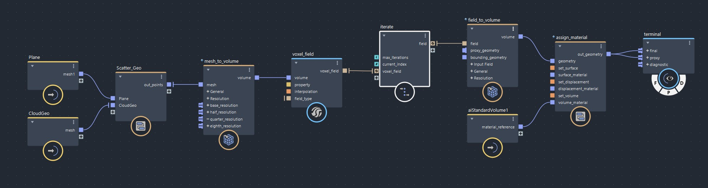
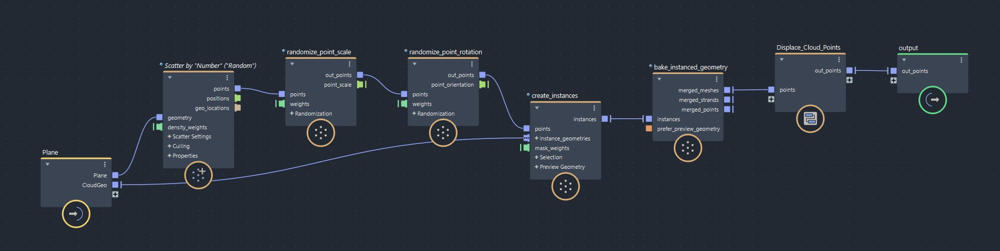
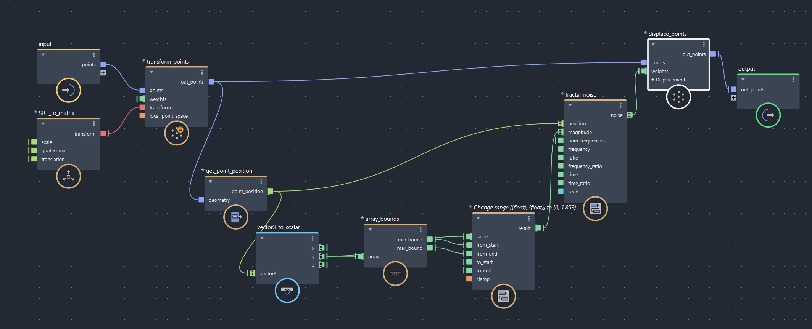

# Welcome to the Bifrost Clouds lab

> This lab is newly made and is supposed to be a supplement for an advanced lecture. As such, most of the information will be in the lecture slides and video attached. In the future, this lab will be populated to act like a normal lab

## Lecture

Lecture slides can be found here https://docs.google.com/presentation/d/1xorNI1PYDMCcyTiIhwxNnvaqvcanCkwa4nEh0wQjMg4/edit?usp=sharing

Lecture video is attached here

## The Descend Compound

The Bifrost Descend compound can be found here

[descend.zip](descend.zip)

Place the descend.json file in Users/<your username\>/Autodesk/Bifrost/Compounds  
If these folders do not exist, create them

## Node Structure

### Main Graph

We're scattering points along a plane and then converting those meshes to a volume. After that, we move the volume based on an iterative advect field before outputting it to the terminal

### Scatter Geo Graph

We're scattering a bunch of points on a plane, randomizing their scale and rotation. Then on each point, we create instances of the Cloud Geo and turning those instances into a mesh.

After that, we displace the cloud points so they look more natural before outputting the final mesh

### Displace Cloud Points Graph

We're first squashing the sphere so it's more flat. Then we're getting each geometry point and increasing the height of it while keeping the bottom flat. After that, we apply some noise to give it more shape and outputting it

### Iterate Graph

We're feeding an advect field into itself the `max_iterations` number of times. Based on each time we're doing it, we're lowering its intensity and `time_step`

## Useful Compounds

- mesh_to_volume  
  converts as mesh to a volume
- volume_to_mesh  
  converts a volume to a mesh
- volume_scope, vector_field_scope, etc  
  provides diagnostic info. Plug geometry into bounds to limit its range
- terminal  
  provides a better way of separating out your outputs than the output compound. Final is for rendering, proxy is for viewport, and diagnositc if for diagnostic info
