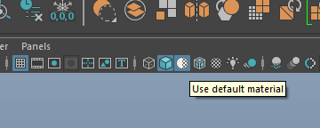
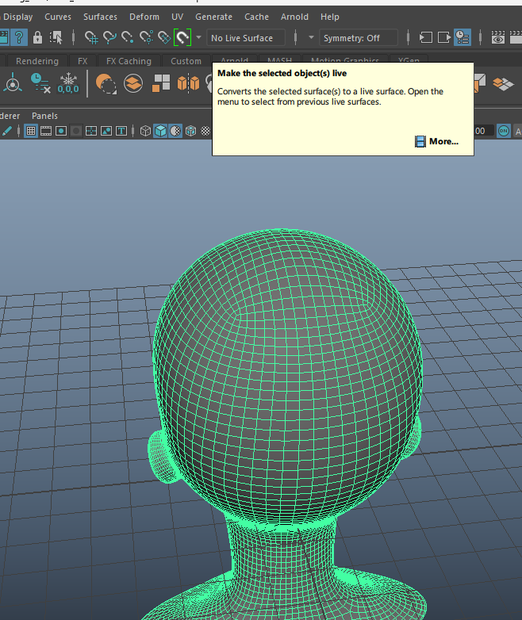
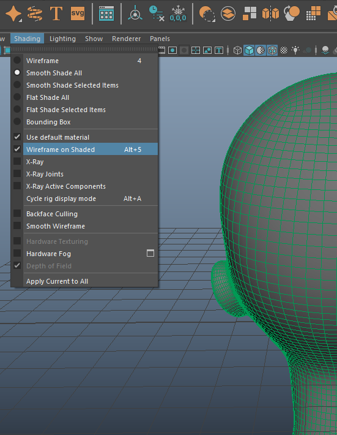
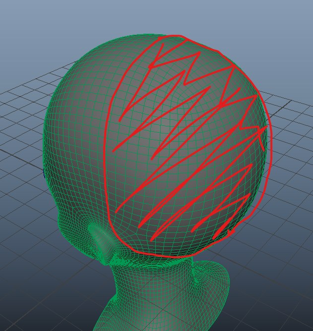
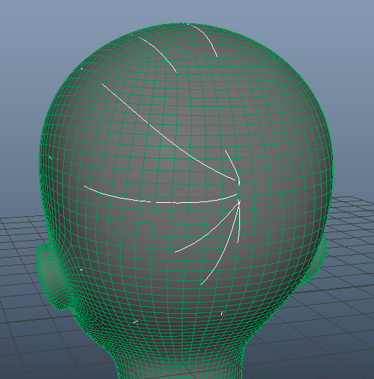
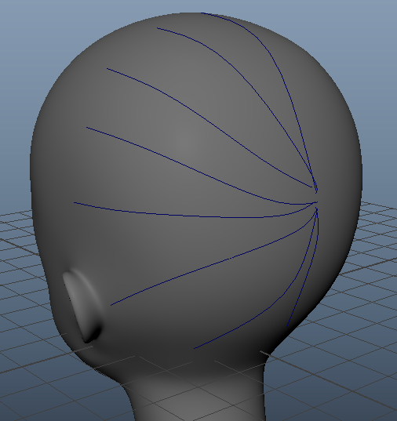

# Polygon Hair Modeling

Welcome to the polygon hair modeling lab! There are quite a few different ways to model hair. Today, we're going to model it using polygons! Polygon hair makes a really stylized look that is perfect for anime or cutesy low-poly models (or if you don't want to deal with xgen).

In this lab, we're going to be making a long ponytail with bangs. We'll be going over some different techniques for making different hairstyles as well. Then, at the end, we'll briefly touch upon methods on shading the hair.

For all of these sections, please download and reuse this anime head mesh, taken from Marfab.

[Head_BaseMesh.ma](Head_BaseMesh.ma)

"Anime Head Base Mesh" (https://skfb.ly/oBSEQ) by MarFab is licensed under Creative Commons Attribution (http://creativecommons.org/licenses/by/4.0/).

# The Back

Let's start off with modeling the back of the hair. To do this, we're going to be using the sweep mesh tool extensively.

To begin with, we're going to toggle the Use Default Material button just to make our lives easier so we don't have to deal with shaders messing up visibility on our viewport.

With our selected object, we want to click the Make Selected Objects Live button here. You may already be familiar with this if you've done retopology, but essentially, for our purposes, this will make the curves we create next stick onto the mesh.

You will notice that once an object is live, you won't be able to select it normally. That's ok. In order to still be able to see the wireframe, we can click Alt + 5 to toggle on wireframe on shaded display mode. Alternatively, you can click this button here.

We define the back of the head as this entire section in red here. Everything behind the ears is essentially the "back" here.

Begin by using the EP Curve Tool (or any curve creation tool of your choice) to create evenly spaced strands that focus towards the start of the ponytail here. It is okay if your curve doesn't fully appear on top of the mesh and is partially obscured. We will be fixing that in a bit.

I've highlighted the curves here so it's easier to see. We only need to do it for once side since we'll be mirroring it shortly.

After we've created these curves, let's select them all and move them a bit to offset them so they don't clip inside the head. Feel free to turn off live surface and display wireframe on shaded to adjust the curves as you feel fit. It might be useful to add new points, adjust the control vertexes, or adjust the points of the curve to create a better distribution.

We won't be needing live surface or display wireframe on shaded next, so I've disabled them.

