# Introduction

Welcome to the Arnold rendering lab! In this lab, we will be going over the render settings used by the Arnold renderer, as well as how to set up After Effects to display your beautiful short in all its glory.

For this lab, you will be needing **Adobe After Effects** installed.

> (!info)
> Adobe After Effects is free for students as a part of the Creative Suite Student Edition

# Render settings

First, what is rendering? Rendering is the process of simulating light using ray tracing to accurately represent your entire scene with proper colors, lighting, geometry, shadows, textures, and more.

In real life, light comes from the sun (or other various light sources), bounces around, and eventually hits your eyes. The light that hits your eyes contains the data for its proper color depending on what objects the light wave hit, passed through, and more. Rendering is the process of simulating that, but on your computer. As such, you can imagine that it **takes a very very** **_very_** **long time** and is very computationally intensive.

> (!important)
> Please please please, START EARLY. DO NOT PROCRASTINATE when rendering during render week. You will run into a lot of issues and even if you don't, rendering itself takes a massive amount of time.

> (!info)
> A single frame takes about 3 to 5 (or more!) minutes to render. At 24 frames a second, 1 minute of animation will take on average 96 hours.
> 60s \* 24fps \* 4mins / 60s = 96 hours

Before you start rendering, please make sure all your scenes are **COMPLETELY FINALIZED**. You cannot edit anything after you render since rendering is essentially "FINAL". If you want to change anything, you will have to rerender the **entire thing**. Make sure everything is completely final and double triple check all your animations and lighting are correct.

## Let's get started

To get started, first make sure you have the rendering toolbar selected. On the upper left hand corner, underneath **File**, there should be a dropdown menu. Make sure it's set to **Rendering**

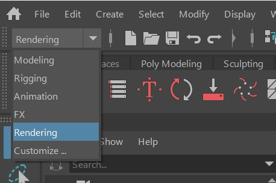

Next, go to the toolbar and click Render -> Render Setup

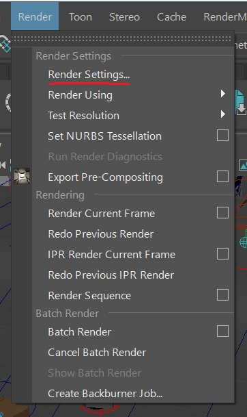

You will then be brought to the render settings page. Here, you can cutomize all the settings of your render.

Since we're working with Arnold, you want to make sure that your renderer is set to the Arnold Renderer

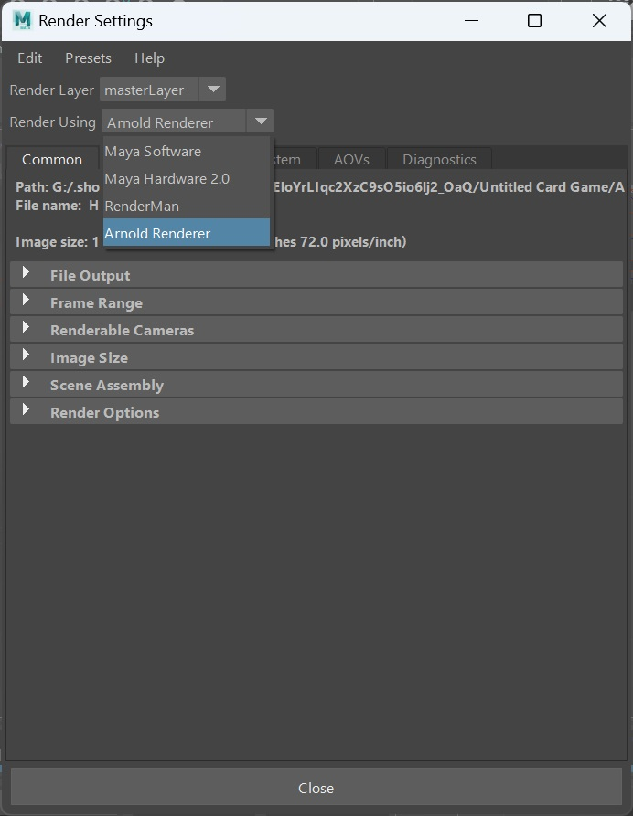

Open up File Output, and here you want to change the settings regarding how your files will be outputted.

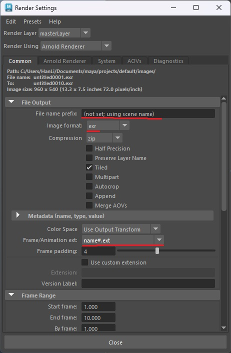

You want to set your File name prefix to something identifiable about your scene. If your naming scheme among your group is to name each scene by who's working on it, then name it Your_Name  
If your naming scheme is to name each scene by its name or its number, then do that. At any rate, make sure your file name prefix represents something identifiable about your scene.

Next you want to change your image format to **exr**. Exr files can store a lot of image data so they allow for more accurate colors and other fancy stuff (that we will not be getting into) regarding other various render settings.

Under Metadata, you want to change Frame/Animation ext to **name#.ext**. This will make it so you can render more than 1 frame during the rendering sequence.

Also make sure to change your Color Space to Raw

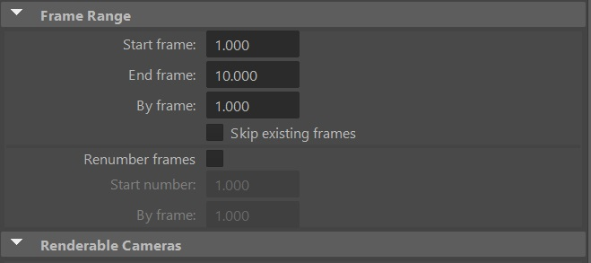

Next, scroll down and you want to set your start frame and end frame of your render sequence here

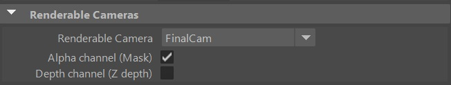

> (!important)
> Make sure you set your Renderable Camera to the camera you are using for your scene. If you set it to the default perspective camera, you will only render what is visible from the defaut perspective camera

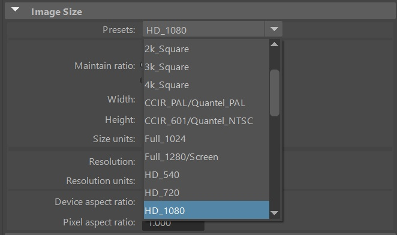

Scroll down further. Under Image Size, change the presets to **HD_1080**. This will make sure you're rendering in 1080p. Alterantively, you can set it to a different value. The important thing is making sure that **all scenes rendered by all group members have the same image size**.

---

Next, go and click on the Arnold Render tab

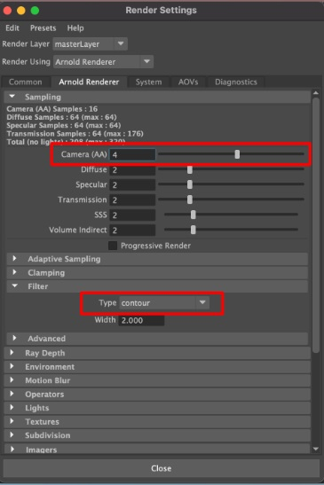

You want to change your **Camera (AA)** to 4 as an optimal value. This value will change the number of samples you have. Here, a Camera (AA) value of 4 will give you 16 samples.

Since the number of samples essentially is the value of how many particles of light to simulate, the number of samples directly correlates to how detailed your render will be. Lower samples results in a more grainy image while higher samples results in a more clear image.

> (!info)
> I recommend keeping this value from between 3 to 6. Anything too low will result in an overly grainy image, and anything too high will dramatically increase the amount of time it takes to render your scene.

If you have any edge outlines in your scene (IE: Toon Shader), setting the Filter Type to "contour" will make it actually work.

_Interesting settings to note under Arnold Renderer tab_

- You can have environment fog by going to Environment and setting the Atmosphere to _fog_ or _atmosphere_volume_
- You can enable motion blur by going to Motion Blur and clicking enable. Here are the settings referenced by the official Arnold documentation
  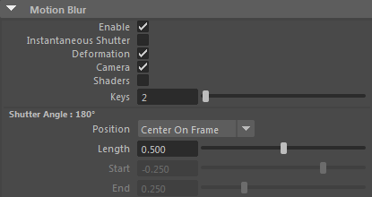

---

Next, you want to navigate to the AOVs tab.

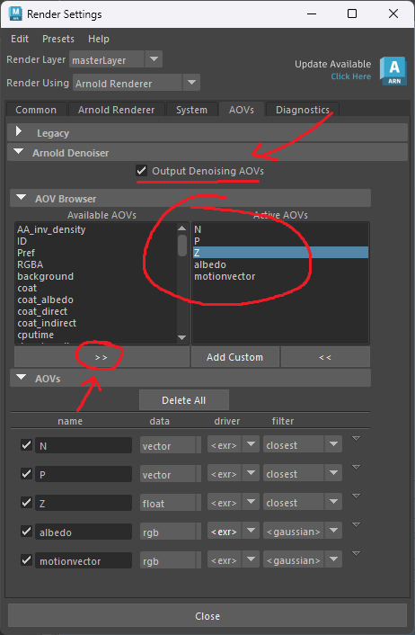

Now, you want to go to the **AOV Browser** and among the Available AOVs menu, find and add RGBA. This will specify the color channels and settings for your .exr files. TLDR match the image above.

## Time to actually render!

After exiting the Render Settings menu, go to Render -> Render Sequence and click the option box.

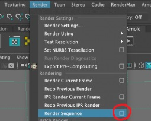

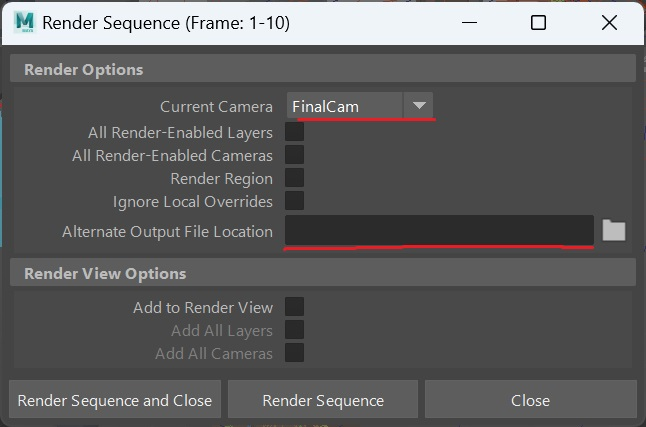

Make sure your Current Camera is set to the right camera. Additionally, make sure the Alternate Output File Location is set to where you want to output the exrs for your scene. Make that each scene has its own dedicated folder.

Once you're done double checking everything, click Render Sequence and wait!

> (!important)
> During this time, Maya will be frozen. Rendering will take a very very long time. If at any point you want to stop the rendering, click ESCAPE on your keyboard. On the flip side, **DO NOT CLICK ESCAPE UNLESS YOU WANT TO STOP YOUR RENDERING**

# Compositing

Now that you have your lovely frames for your short taking up an absurd amount of file space, you can now composite them all together and turn them into an equally more lovely video!

First, you want to open Adobe After Effects and create a new project. You can either composite all of your scenes together, or you can do it one scene at a time and combine them afterwards.

Go to File -> Import -> File

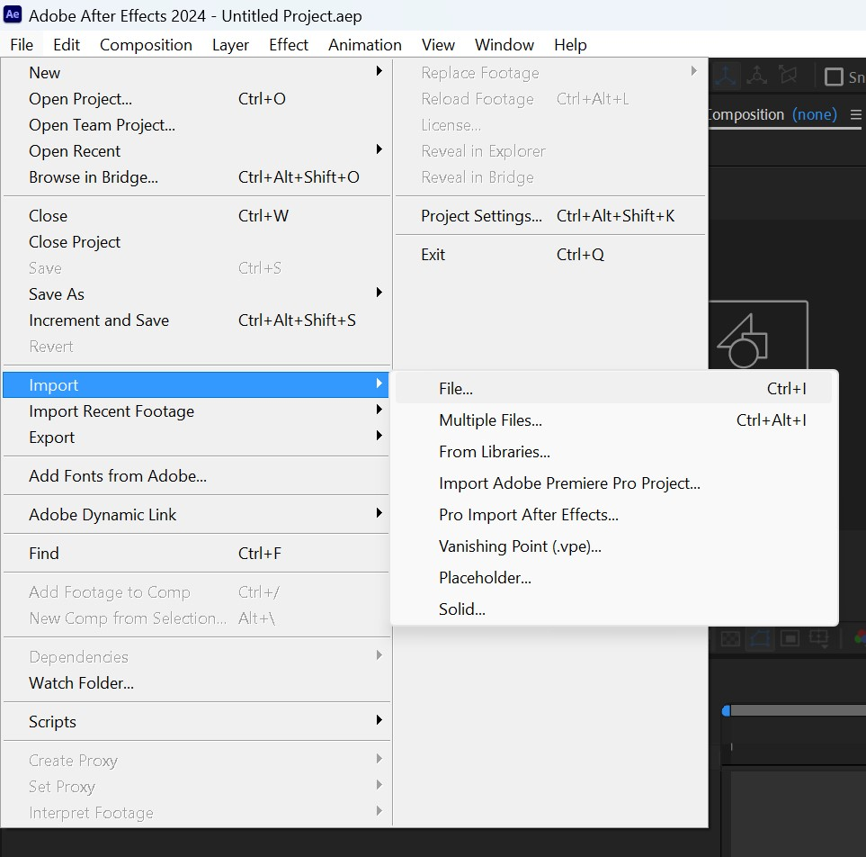

Here, you want to navigate to the location where you stored all your exr's for your scene.

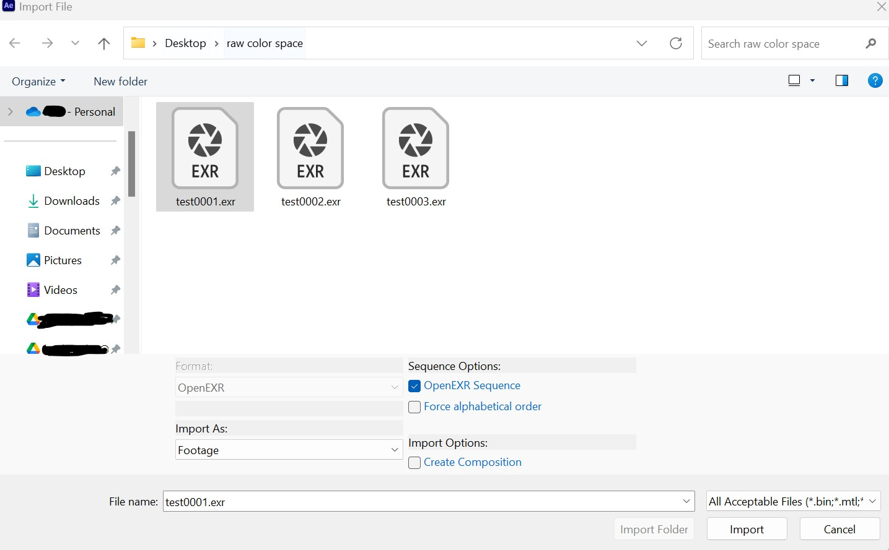

Make sure OpenEXR Sequence is checked.

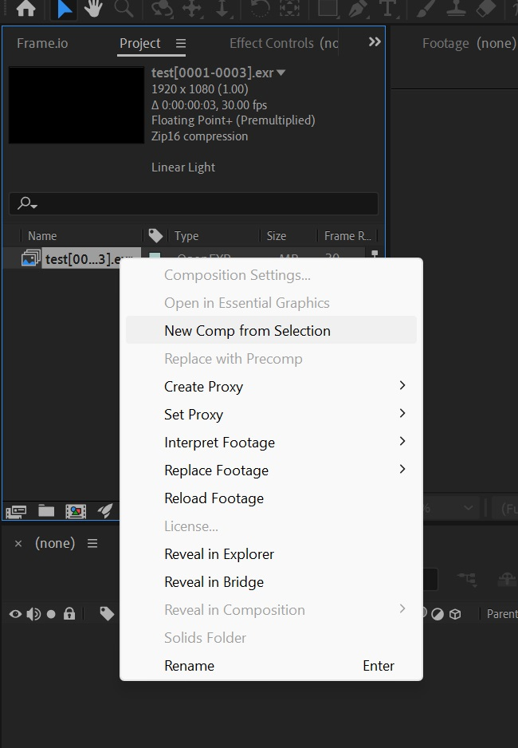

You want to right click your exr sequence and create New Comp from Selection

> (!info)
> **If your composition displays everything correctly, you can skip this entire next part until AE Rendering**

Now you should have a composition that you can play! Unfortunately, it may be completely black.

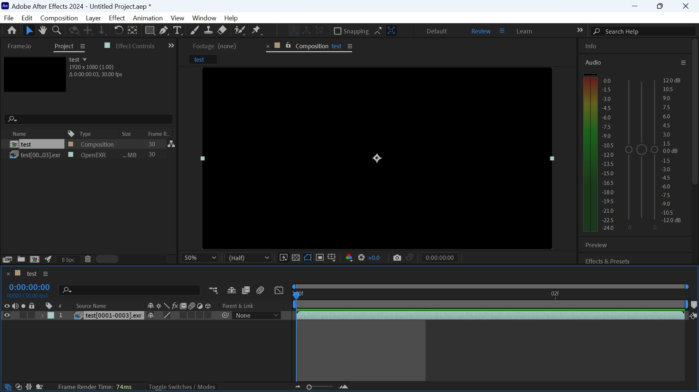

To fix this, right click your exr sequence and go to Interpret Footage -> Main

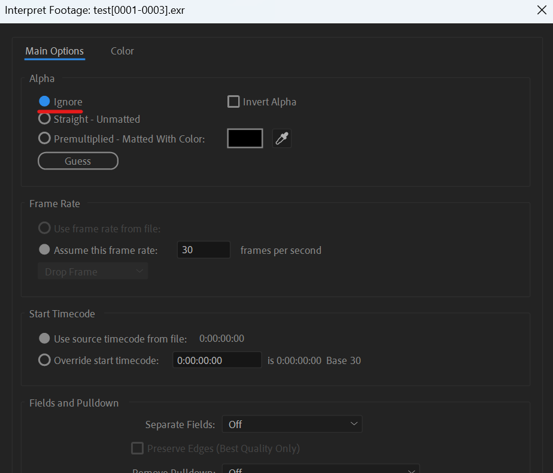

Here, make sure to change the Alpha to Ignore.

Now, you should be able to see color! Unfortunately, your scene will now look incredibly whitewashed.

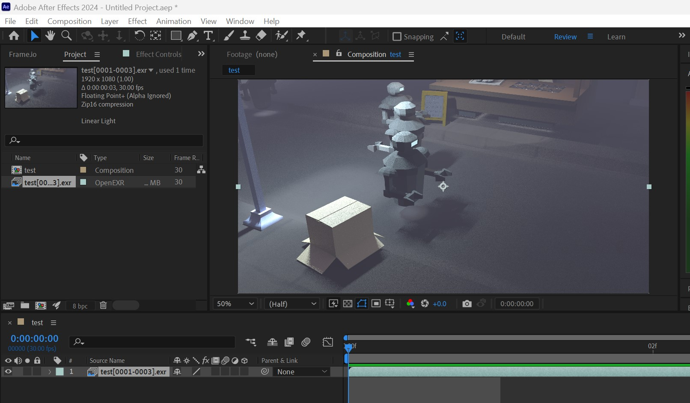

To fix this, go back to the same Interpret Footage settings, and go to the Color tab and click Preserve RGB.

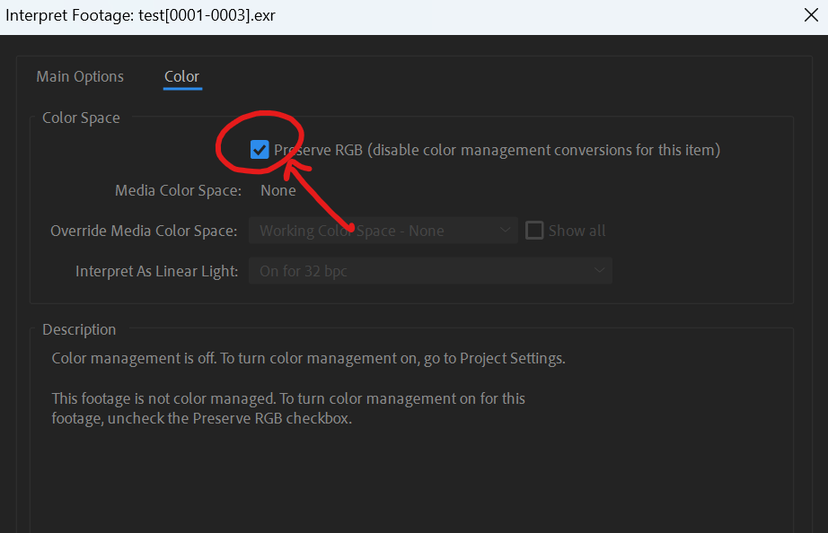

Unfortunately again, your scene will now look too dark

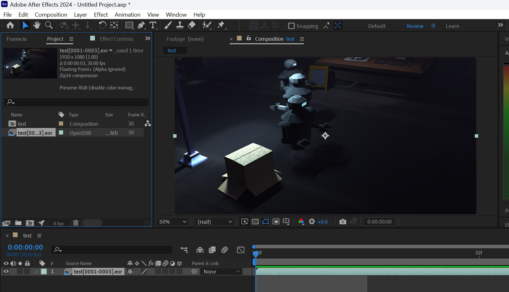

Go to File -> Project Settings

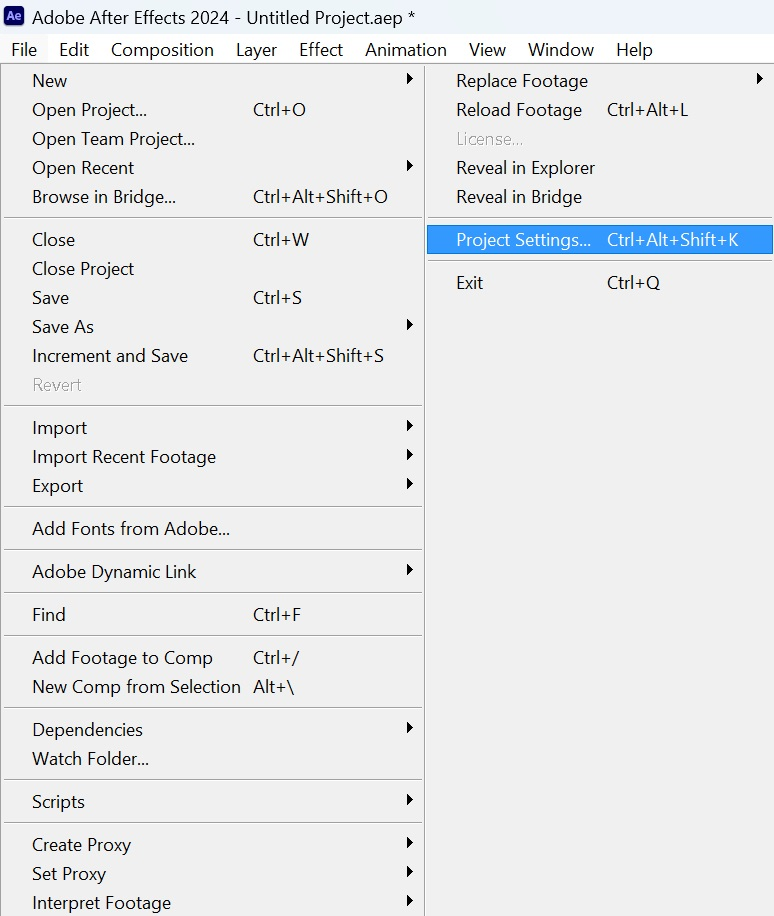

Here, go to the color tab and change the Color Engine from Adobe color managed to OCIO color managed.

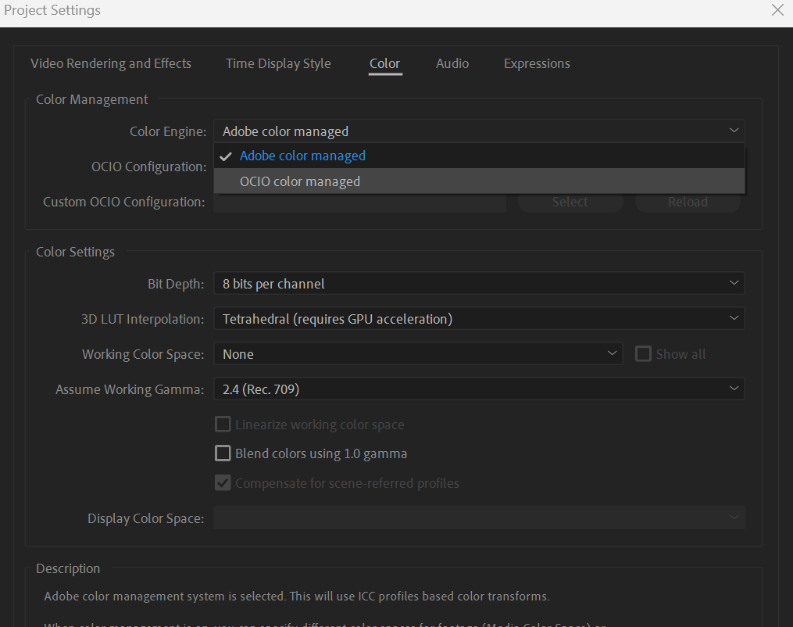

Make sure these settings are set to the following.
Working Color Space should be set to **compositing_linear: ACES - ACEScg** and Display Color Space should be set to **ACES/Raw**

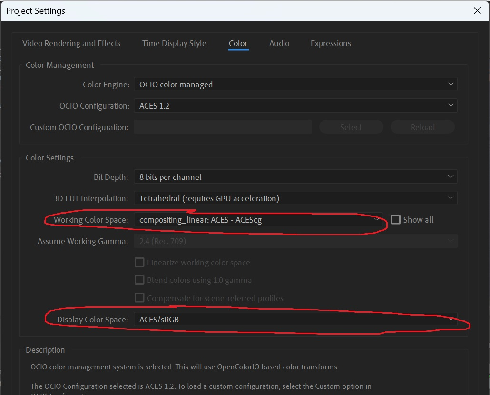

Now, when you save, your colors should look right!

---

Here in After Effects, you can do lots of post processing touch ups if you want. For example, you can denoise, mask, apply other color correction settings, and more. Experiment with it to see what works for you!

---

# AE Rendering

When you're ready to render from After Effects, select your composition and go to File -> Export -> Add to Render Queue

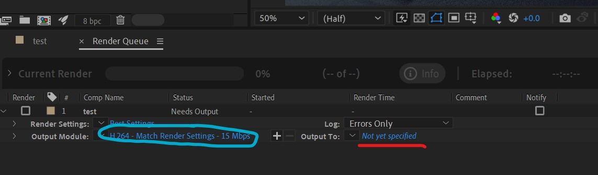

Here, make sure to set your _Output To_ to the file where you want to output your final film.

Next, click on the button that is circled in blue in the above picture. This will bring up the Output Module Settings.

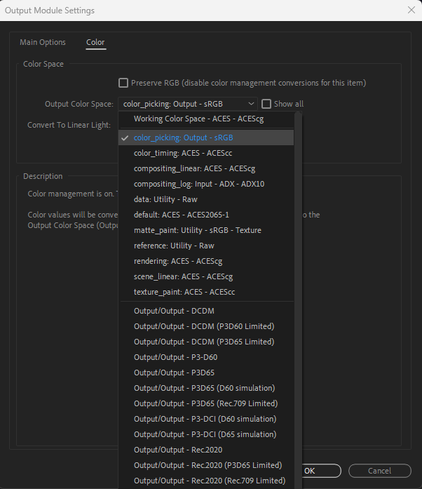

Navigate to the Color tab, and make sure the Output Color Space is set to **color_picking: Output - sRGB**

Now, you can finally select the compositions you want to render and click the render button, wait 10 years, and you're done!

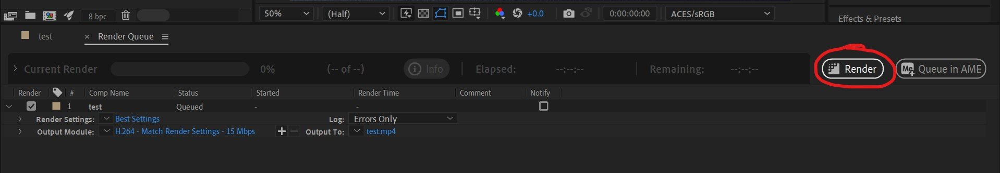

You should now have an .mp4 file that you can play as a video.

> (!info)
> If you plan to do more extensive compositing, it might be wise to render/export individual exr sequences as mp4s and then reimport that into After Effects or Adobe Premiere since it will load faster.

# Optional reading

If you're curious as to why the colors were messed up when you imported your exrs into After Effects, you have to understand the idea of color spaces.

TLDR: You cannot display the entire visible spectrum of color on your screen, so we define a small subset of it called a color space to display. For example, RGB is a color space, and CMYK (used for prints) is another color space. Maya and After Effects are owned by different companies and each use their own color space, which is why it's important to change your color space so you can have the correct colors!

https://en.wikipedia.org/wiki/Color_space
