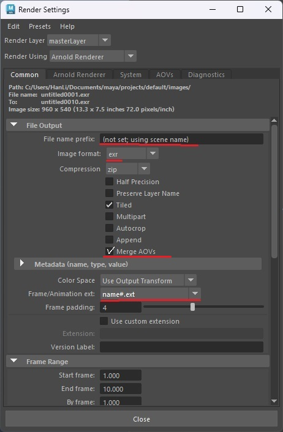
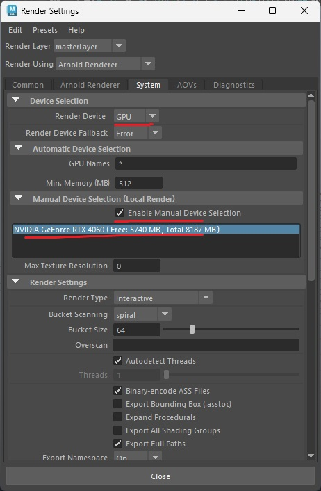
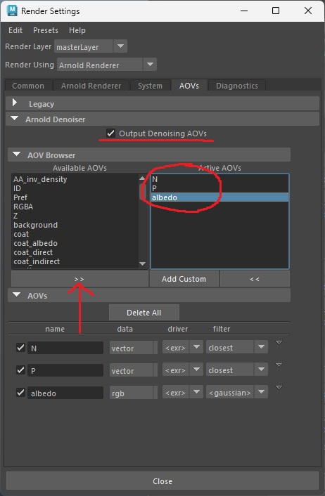
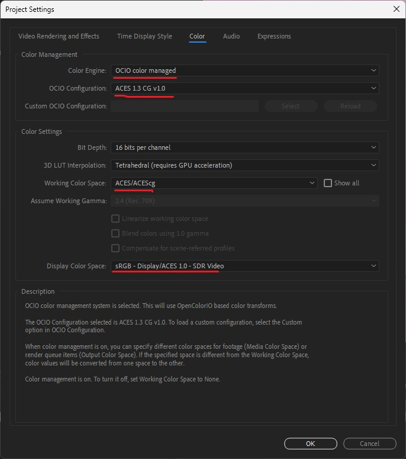
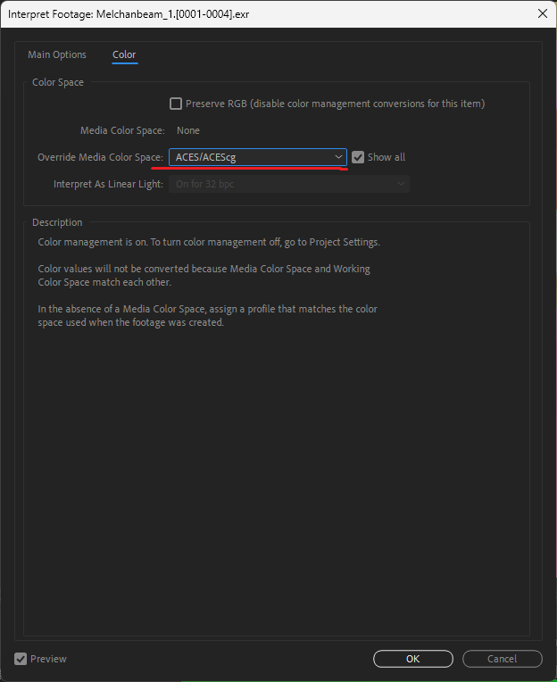
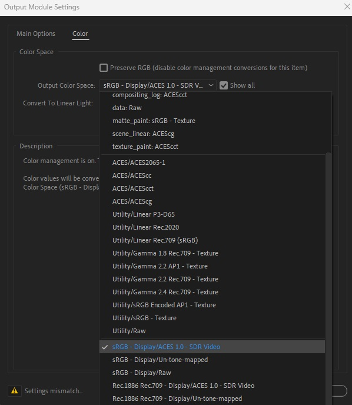

# Introduction

> (!important)
> You should read this lab in its ENTIRETY before starting

Welcome to the Arnold rendering lab! In this lab, we will be going over the render settings used by the Arnold renderer, as well as how to set up After Effects to display your beautiful short in all its glory.

For this lab, you will be needing **Adobe After Effects** installed.

> (!info)
> Adobe After Effects is free for students as a part of the Creative Suite Student Edition

# Render settings

First, what is rendering? Rendering is the process of simulating light using ray tracing to accurately represent your entire scene with proper colors, lighting, geometry, shadows, textures, and more.

In real life, light comes from the sun (or other various light sources), bounces around, and eventually hits your eyes. The light that hits your eyes contains the data for its proper color depending on what objects the light wave hit, passed through, and more. Rendering is the process of simulating that, but on your computer. As such, you can imagine that it **takes a very very** **_very_** **long time** and is very computationally intensive.

> (!important)
> Please please please, START EARLY. DO NOT PROCRASTINATE when rendering during render week. You will run into a lot of issues and even if you don't, rendering itself takes a massive amount of time.

> (!info)
> A single frame takes about 3 to 5 (or more!) minutes to render. At 24 frames a second, 1 minute of animation will take on average 96 hours.
> 60s \* 24fps \* 4mins / 60s = 96 hours

Before you start rendering, please make sure all your scenes are **COMPLETELY FINALIZED**. You cannot edit anything after you render since rendering is essentially "FINAL". If you want to change anything, you will have to rerender the **entire thing**. Make sure everything is completely final and double triple check all your animations and lighting are correct.

## Let's get started

To get started, first make sure you have the rendering toolbar selected. On the upper left hand corner, underneath **File**, there should be a dropdown menu. Make sure it's set to **Rendering**

Next, go to the toolbar and click Render -> Render Setup

You will then be brought to the render settings page. Here, you can cutomize all the settings of your render.

Since we're working with Arnold, you want to make sure that your renderer is set to the Arnold Renderer

Open up File Output, and here you want to change the settings regarding how your files will be outputted.

You want to set your File name prefix to something identifiable about your scene. If your naming scheme among your group is to name each scene by who's working on it, then name it Your_Name  
If your naming scheme is to name each scene by its name or its number, then do that. At any rate, make sure your file name prefix represents something identifiable about your scene.

Next you want to change your image format to **exr**. Exr files can store a lot of image data so they allow for more accurate colors and other fancy stuff (that we will not be getting into) regarding other various render settings.

Under Metadata, you want to change Frame/Animation ext to **name#.ext**. This will make it so you can render more than 1 frame during the rendering sequence.

Next, scroll down and you want to set your start frame and end frame of your render sequence here

> (!important)
> Make sure you set your Renderable Camera to the camera you are using for your scene. If you set it to the default perspective camera, you will only render what is visible from the defaut perspective camera

Scroll down further. Under Image Size, change the presets to **HD_1080**. This will make sure you're rendering in 1080p. Alterantively, you can set it to a different value. The important thing is making sure that **all scenes rendered by all group members have the same image size**.

---

Next, go and click on the Arnold Render tab

You want to change your **Camera (AA)** to 4 as an optimal value. This value will change the number of samples you have. Here, a Camera (AA) value of 4 will give you 16 camera samples.

> (!info)
> I recommend keeping this value from between 3 to 5. Anything too low will result in an overly grainy image, and anything too high will dramatically increase the amount of time it takes to render your scene.

Since the number of samples essentially is the value of how many particles of light to simulate, the number of samples directly correlates to how detailed your render will be. Lower samples results in a more grainy image while higher samples results in a more clear image. Depending on how your scene is structured, mess around with the other sample counts like Diffuse, Specular, Transmission, etc to see if your scene still looks good. Do a couple test renders to optimize.  
Additionally, you can take a look under Ray Depth and mess around with those settings. To understand what this does more, review the lecture slides

If you have any edge outlines in your scene (IE: Toon Shader), setting the Filter Type to "contour" will make it actually work.

_Interesting settings to note under Arnold Renderer tab_

- You can have environment fog by going to Environment and setting the Atmosphere to _fog_ or _atmosphere_volume_
- You can enable motion blur by going to Motion Blur and clicking enable. Here are the settings referenced by the official Arnold documentation
  

> (!important)
> I would recommend NOT using motion blur here as 3D motion blur is often overkill and will drastically increase your render times

If you have a compatible scene, you can render using GPU instead of CPU. Arnold does not have GPU rendering for any scenes that are Toon Shaded or have Volumetrics. Unfortunately, you will have to CPU render if that's the case. Additionally, you must have a compatible Nvidia GPU.

You can go to the System tab and change your Render Device to GPU if your scene meets the requirements. Rendering with GPU is leagues faster than with CPU.

Here, you want to enable manual device selection and select your gpu as well just to be on the safe side.

---

Next, you want to navigate to the AOVs tab.

Now, you want to go to the **AOV Browser** and among the Available AOVs menu, find and add N (Normal), P (Position), and albedo. These AOVs will help the Arnold Denoiser in denoising your image. Also, make sure you check Output Denoising AOVs at the top. To add AOVs, simply select the respective AOV from the left under Available AOVs, and click the arrow to move it to the right.

## Time to actually render!

After exiting the Render Settings menu, go to Render -> Render Sequence and click the option box.

Make sure your Current Camera is set to the right camera. Additionally, make sure the Alternate Output File Location is set to where you want to output the exrs for your scene. Make that each scene has its own dedicated folder.

Once you're done double checking everything, click Render Sequence and wait!

> (!important)
> During this time, Maya will be frozen. Rendering will take a very very long time. If at any point you want to stop the rendering, click ESCAPE on your keyboard. On the flip side, **DO NOT CLICK ESCAPE UNLESS YOU WANT TO STOP YOUR RENDERING**

> (!important)
> ALWAYS render 1 frame first before leaving your computer. Render 1 frame, check your EXR, make sure everything is correct, colors work, etc. You can view EXR files in Maya by opening the Arnold Render View and going to File -> Open. It would really bad if you spent days rendering your short only to realize that your render settings weren't working. RENDER 1 FRAME FIRST!!!

## Denoising

Once your scene finishes rendering, you can now move onto denoising. This is one particular method of denoising and it is a bit slow, however it does achieve better results than a 2D denoiser like the ones in After Effect. If your scene does not need denoising or you want to do it in After Effects instead, then skip this step.

You can find the Noice denoiser by going to Arnold -> Utilities -> Arnold Denoiser (noice)

Here you can adjust the denoiser settings. The first thing to pay attention to is the input and output locations of your file. Set your input to where you store your exrs. The #### in the file path indicate the relative number/index of the file. For example, if your files are named file0001.exr, file0002.exr, etc, you want to put file####.exr. Alternatively, if your files are named file.0001.exr, file.0002.exr, you want to put file.####.exr. If you followed the file naming conventions earlier in this lab, it should be file####.exr.

- Temporal Stability frames determine who stable your denoising is over time. A higher value will make the denoider look at more frames in order to temporally denoise.
- Pixel search radius is how many pixels the denoiser looks at to determine the color of any individual pixel.

Play around with these two settings with a small frame range until you're satisfied before doing it on the complete sequence. This process might take a while

# Compositing

Now that you have your lovely frames for your short taking up an absurd amount of file space, you can now composite them all together and turn them into an equally more lovely video!

First, you want to open Adobe After Effects and create a new project. You can either composite all of your scenes together, or you can do it one scene at a time and combine them afterwards.

Go to File -> Import -> File

Here, you want to navigate to the location where you stored all your exr's for your scene.

Make sure OpenEXR Sequence is checked.

Next, you want to match After Effect's color space to the one we were using in Maya to make sure all the colors are correct.

Go to File -> Project Settings

Here, go to the color tab and change the Color Engine from Adobe color managed to OCIO color managed.

Make sure these settings are set to the following.
OCIO Configuration should be set to **ACES 1.3 CG v1.0**. Working Color Space should be set to **ACEScg** and Display Color Space should be set to **sRGB - Display/ACES 1.0 - SDR Video**

Next, right click your exr sequence and go to Interpret Footage -> Main

Set Alpha to ignore if your footage is completely black, if not, you can leave it as is.  
**However, make sure to set your frame rate to 24fps!**

Next, go to the color tab and make sure Override Media Color Space is set to **ACES/ACEScg**

Now, you want to right click your exr sequence and create New Comp from Selection

You should have a composition that you can play!

As a good rule of thumb, you should also apply the EXtractoR effect onto your exr sequence in your composition. Select your exr sequence in your composition, and then go to Effects & Presets on the right, and assign the EXtractoR effect to it.

---

Here in After Effects, you can do lots of post processing touch ups if you want. For example, you can mask, apply other color correction settings, add bloom, and more! Experiment with it to see what works for you!  
If you want to mess around with specific AOVs, you need to duplicate your exr sequence in your workspace and apply an EXtractoR effect to it. This will allow you to select specific AOVs to display.

---

# AE Rendering

When you're ready to render from After Effects, select your composition and go to File -> Export -> Add to Render Queue

Here, make sure to set your _Output To_ to the file where you want to output your final film.

Next, click on the button that is circled in blue in the above picture. This will bring up the Output Module Settings.

Navigate to the Color tab, and make sure the Output Color Space is set to **sRGB - Display/ACES 1.0 - SDR Video**

Now, you can finally select the compositions you want to render and click the render button, wait 10 more years, and you're done!

You should now have an .mp4 file that you can play as a video.

> (!info)
> If you plan to do video editing, it might be wise to render/export individual exr sequences as mp4s and then reimport that Adobe Premiere since it will load faster and has a more efficient workflow for those types of processes.
