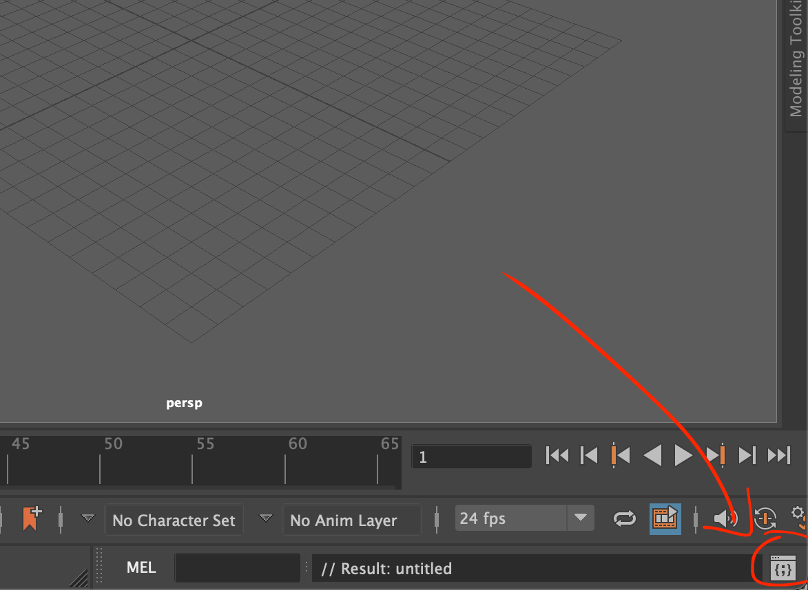
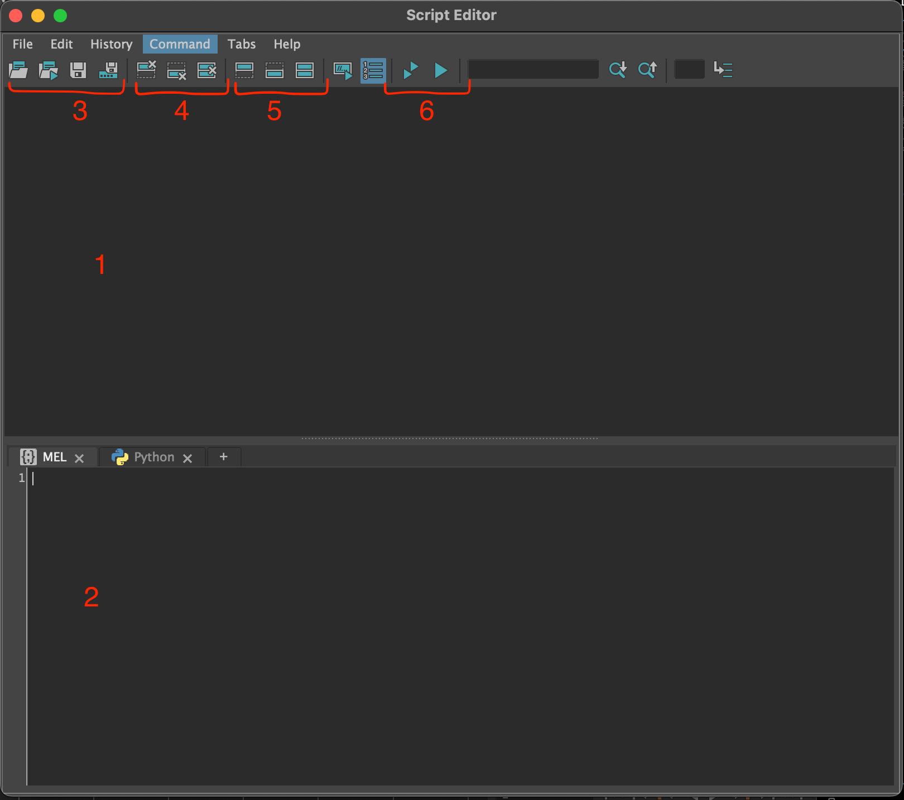
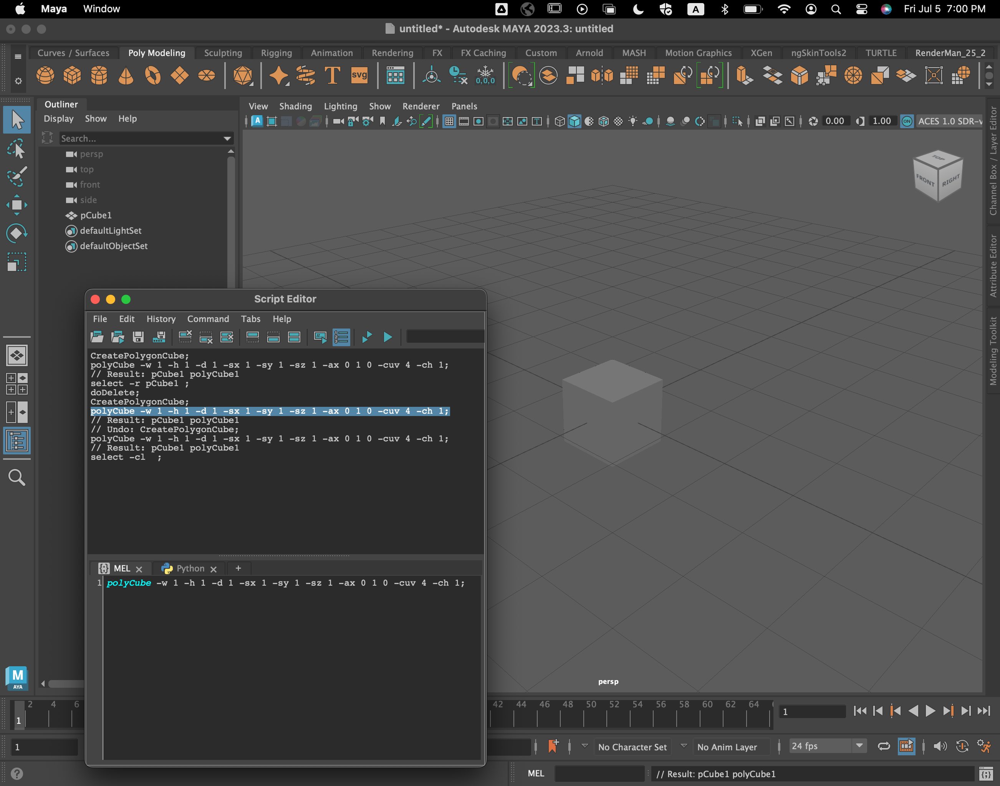
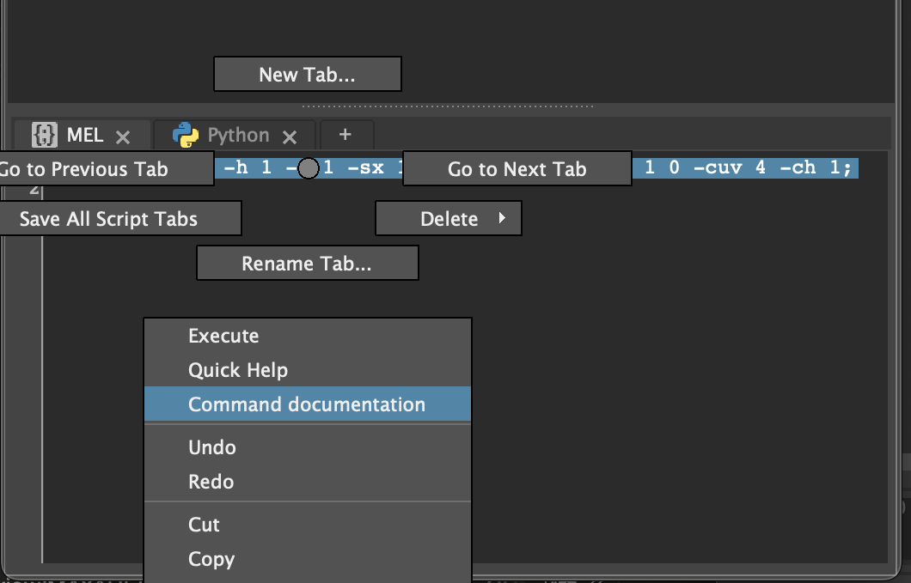
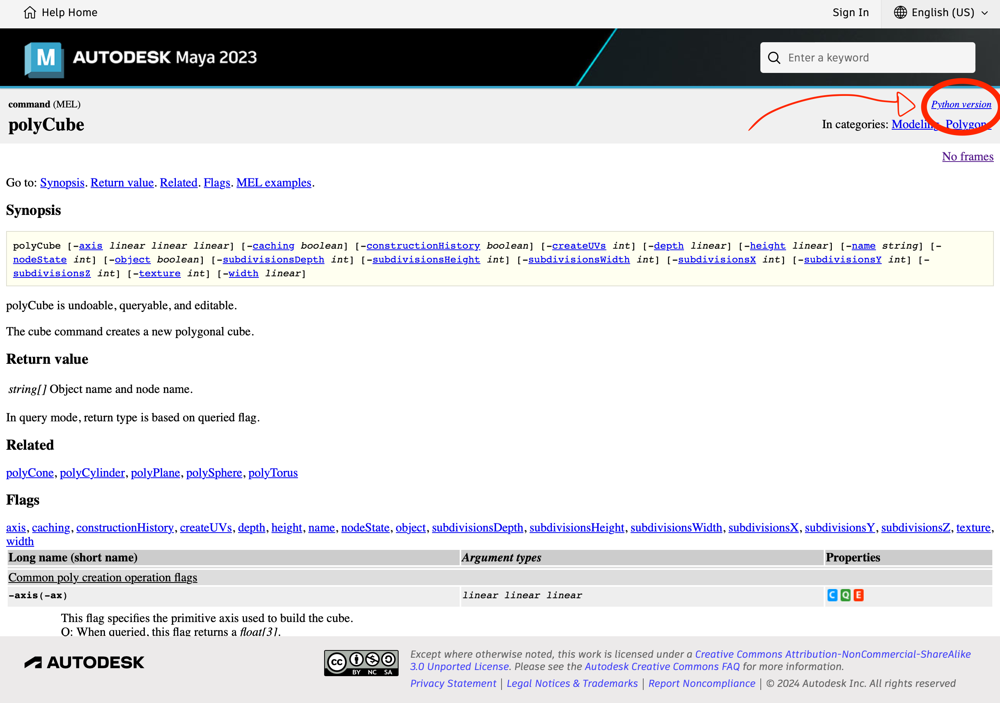
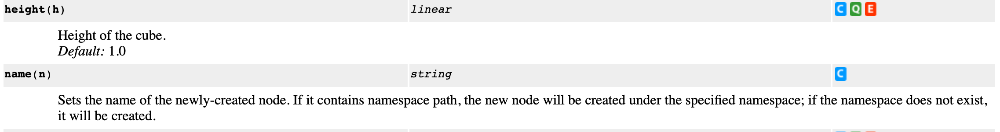
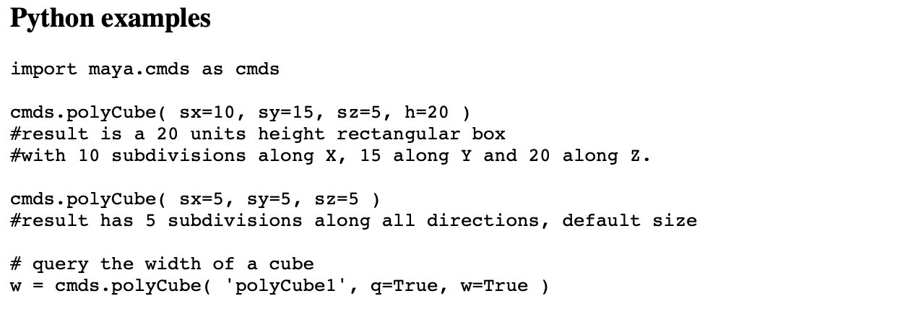
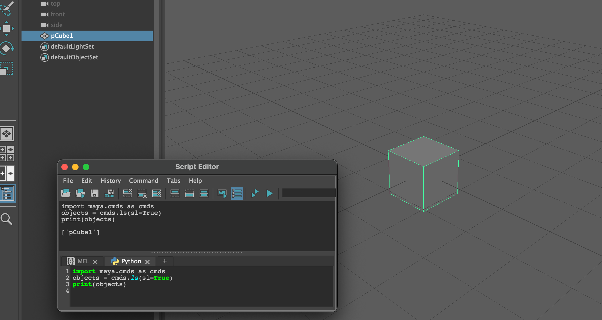
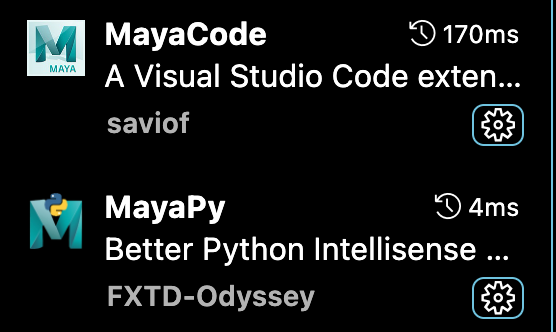

# INTRODUCTION

We will explore fundamental Maya Python scripting skills to help you create your very first custom tool not yet available in Maya. Specifically, we will develop a pivot snapping script that centers the pivot of one object onto another object's center. This tool will enable you to easily rotate a camera around an object or have other objects rotate around another object's central point. Our final product will look like this:

<!--  demo below -->

<!-- demo above -->

We hope that you will find this script useful in your team's workflow!

> (!important)
> This lab assumes a basic understanding of Python 3.0+ (equivalent to Berkeley's [CS 10](https://cs10.org/),
>  [Data 8](https://www.data8.org/sp24/), or the first two weeks of [CS 61a](https://cs61a.org)).
> We will cover basic data types (ints, strings, booleans, lists), if statements, for loops, functions, and lambdas.
> Object-oriented programming is not covered.

## LEARNING THE INTERFACE

The most straightforward way to execute your code is using the built-in Maya script editor. Or, you can use your own IDE or code editor of choice (Vim, Visual Studio, Visual Studio Code, PyCharm, XCode, etc). If you'd like to follow this lab in Visual Studio Code, check out this section and then skip Maya Commands API (Part 1). However, I will be **explicitly teaching how to use the Maya Script Editor** throughout this lab.

**Script Editor**

Maya's script editor is an easy way to get your code up and running. You can pull up the script editor by clicking in the bottom right corner of the screen:

When you click it, a window should pop up that looks similar to the one below. Let's explore what each button means:

1. Terminal output
2. Script Editor, written in Python or MEL (Maya's own scripting language)
3. (From left to right), open a script from your computer, source a script, save script written in the script editor, save script to shelf
4. (From left to right) clear terminal output, clear code in script editor, clear both code and terminal output
5. (From left to right) show only terminal, show only script editor, show both
6. (From left to right) play code, play code and clear script editor

## MEL vs Python Scripting
Let's start off by adding a simple polygon to the scene as we would normally do. After placing the block, we see that the terminal outputs something. This is the MEL command for placing a polygon. Try deleting the polygon you just placed, copy and paste the terminal output into the MEL script editor, and running the command by clicking on one of the execution buttons (outlined in 6).

For example, if you wanted to place a cube, you can run either 

<code>CreatePolygonCube;</code> 

or 

<code> polyCube -w 1 -h 1 -d 1 -sx 1 -sy 1 -sz 1 -ax 0 1 0 -cuv 4 -ch 1;</code>

Perhaps you also noticed that there was another output in the terminal when you deleted or selected your polygon. You can run the same commands using the script editor and achieve the same result via the viewport.

Let's try running some Python scripts. We can find the Python equivalent of our MEL command by copying and pasting the terminal output MEL command into the MEL script editor, highlighting the entire command, right click and drag down to "Command Documentation".

A screen will pop up in your browser. It should look something similar to this. 

Click on "Python Version" in the upper right hand corner of the window. For the rest of the lab, we will be writing our scripts in Python, and only referencing MEL when we are trying to find its Python equivalent. [This webpage](https://help.autodesk.com/view/MAYAUL/2023/ENU/index.html?contextId=COMMANDS-POLYCUBE) should pop up (if you have Maya 2024 or later, the webpage that pops up will be under that version).

Take some time to read through the command documentation.
- Synopsis
    - All flags the command can take, and a brief description of what the command does
- Return value
    - What the command returns in both query and non-query mode (more on this later)
- Related
    - Commands similar to this one
- Flags
    - Optional arguments. As an example, let's consider the following two flags:
    
    "height" is the name of the flag, or "h" as a short name. If a height is not specified when calling the polyCube command, its height is set to 1.0 by default. Its type is "linear" which is just a float. 

- Python examples
    - Probably the most useful section. You can directly copy and paste this bit and run it in the Python script editor to see what the example does.
    

Let's go back to our Script Editor and create a polyCube in Python.

First, we need to import the Maya commands library. **This is not optional!** On our first line, we will write 

<code>import maya.cmds as cmds</code>

On the next line, we will write the command to place the polyCube: 
 
<code>cmds.polyCube()</code>

**TASK 0:**

As a quick challenge, try playing around with some optional flags when placing a cube. Here's a quick example to get you started: 

<code>cmds.polyCube(subdivisionsZ=3, h=2.5)</code>

Additionally, try finding the command to place a sphere, or a different shape. What's the Python command to delete something? To select something? (Hint: try our trick of selecting something and referring to the MEL command documentation. The answer is in the next section.)
 
## MAYA COMMANDS API (PART 1) - SELECTING AND GETTING OBJECT ATTRIBUTES

### Selecting Objects

In our final product, we want to query two items by selecting them. We can get the names of selected objects in our scene by using the ls command and set the selection flag to True:

<code>objects = cmds.ls(sl=True)</code>

(Optional: What does <code>cmds.ls()</code> do? Can you find the command documentation for ls?)

Let's try printing our <code>objects</code> to see what its contents are:

We see that cmds.ls returns a list with the name of the object we selected in it. Try selecting two objects on your own and running the statement again. You should see that the list now contains all names of objects you have selected.

**TASK 1:**

Let's start writing our final script. First download the skeleton code here:

[twoobjectpivotscript.py](twoobjectpivotscript.py)

In the Script Editor, go to File>Open Script and load the file you just downloaded. It should load in the Script Editor.

Fill out TODO Part 1.1 and Part 1.2. You can check to see that your code works by printing out <code>obj0</code>, <code>obj1</code>, or <code>sel</code>.

> You will only need to know the Maya commands we have taught you up to each task. However, you will also need to be familiar with some basic built-in Python methods that are not covered in this lab.

### Getting Object Attributes

How can we find a particular object's height, position, world matrix, bounding box, etc? We can do so by querying an object's attributes like so:
<code>
import maya.cmds as cmds

cubename = cmds.polyCube()[0] # Creating a polygon gives you its name and node name in a list; we just want to get its name

print(cmds.polyCube(cubename, q = True, h = True)) # the "q" flag tells us that we want to get an attribute from our cube. "h=True" tells us that we specifically want to query the height of the cube.
</code>

To obtain information of an object *not specified as a flag*, we can query its attributes using [cmds.getAttr(object_name)](https://help.autodesk.com/cloudhelp/2022/ENU/Maya-Tech-Docs/Commands/getAttr.html). For example, we can get the maximum coordinate of a polyCube's bounding box by using the following code:

<code> 
import maya.cmds as cmds

cubename = cmds.polyCube()[0]

print(cmds.getAttr(cubename + ".boundingBoxMax"))
</code>

## MAYA COMMANDS API (PART 2) - MODIFYING OBJECT PIVOT

## MAYA COMMANDS API (PART 3) - CREATING UI ELEMENTS

## HOW TO USE YOUR TOOL

## SUBMISSION

## OPTIONAL: EXTRA CREDIT OPPORTUNITIES

## MISC: SETTING UP VSCODE

> (!important)
> This section assumes you have a basic knowledge of Visual Studio Code's UI

There are pros and cons to using the Script Editor as opposed to Visual Studio Code, or another third-party code editor. For one, Maya's script editor won't tell you where you may have syntax or other compile-time errors. This is especially inconvenient if you get an indentation error, and you have to go through hundreds of lines of code finding where that error is. However, Maya's Script Editor has the benefit of directly checking a command's documentation.

Good news is, getting VSCode or an external editor to write your scripts is pretty easy!

Start by creating a Python file, and then saving it in an easy-to-locate directory. Write a simple print statement in the file, so we can see that it works when we import it into Maya.

Open Maya, and the Script Editor. Go to File>Open Script and locate your newly created python file. When you open it, the file should successfully load and you should see your print statement. To test that it works, run the command.

We can now make edits in VSCode, and it would automatically update it in Maya's Script Editor. However, any changes we make within Maya's Script Editor won't show up in VSCode.

Optionally, I like to use the extensions MayaCode and MayaPy so that it autocompletes a Maya command that I'm typing. I can also see what flags a command has.

## MISC: PLUG-INS

Coming soon! We might have a separate lab for this if enough people are interested.
