# Introduction

In this lab, you will get familiar with Substance Painter and importing/exporting materials from Substance Painter to Autodesk Maya. We will start off making a cardboard tree texture that looks handpainted.

# Downloading Substance Painter

To download Substance Painter for free, you need to be a registered Berkeley Student then download Adobe Creative Cloud. You can find out your Eligibility and how to download Adobe Creative Cloud [here](https://software.berkeley.edu/adobe-creative-cloud). From Adobe Creative Cloud, you can search up "Substance 3D Painter" in the search bar at the top, then click install.
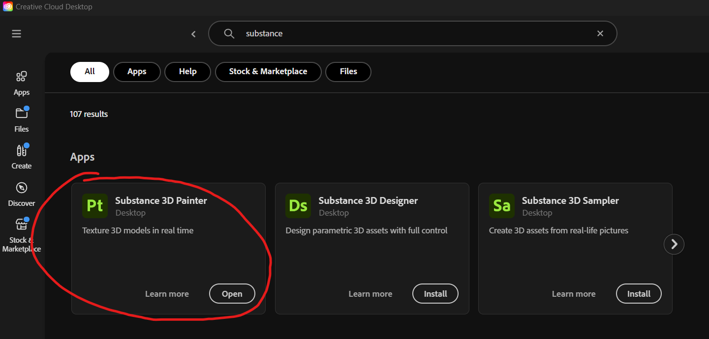

# Preprocessing in Maya - Vertex Coloring

In order make texturing easier in Substance Painter, we prepare the mesh for importing using a technique called: **Vertex Coloring**

> Download the cardboard tree here:

[Cardboard Tree](main_tree.ma)

> (!info)
> Vetex Coloring is coloring the mesh (specifically the vertices) to group which part of the textures goes to which part of the mesh. Example: For a car, you would vertex color the chassis (body) one color and the wheels another color to group the metal textures of the chassis and the rubber textures of the car.

To apply Vertex Color: In the general workspace, click Mesh Display -> Apply Color, then click on the window icon on the right hand side of the bar indicated by the arrow in the image. A window called "Apply Color Options" will pop up.
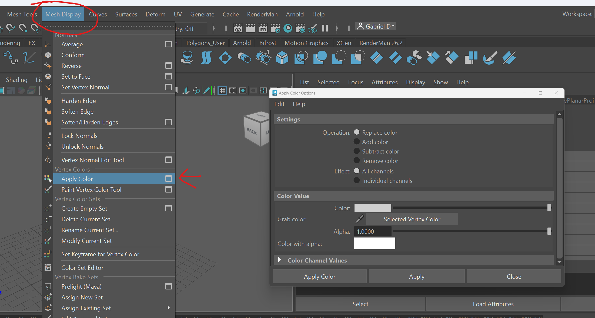

This is where you can add, replace, substace or remove vertex colors. Select all 3 meshes, click the color box and select a random color. Then click "Apply". This applies a single vertex color to the entire asset.

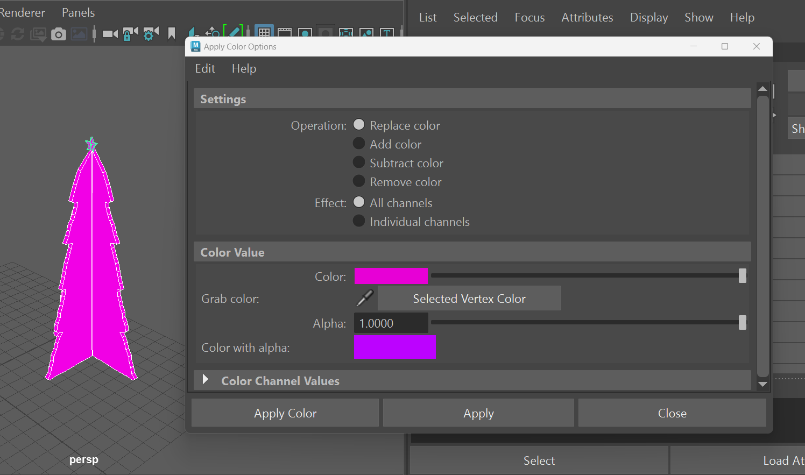

> (!important)
> The color itself does not matter to the texturing, as long as the color is distinct from other vertex colors used. For the sake of clarity, I will be using the brightest colors I can find.

From here we want to select and apply different colors to the meshes depending on what we want our cardboard tree to look like. In this lab, we will use 3 vertex colors: Bright Pink for the base of the tree, Bright Blue for the edges of the tree, Bright Yellow for the star at the top of the tree.

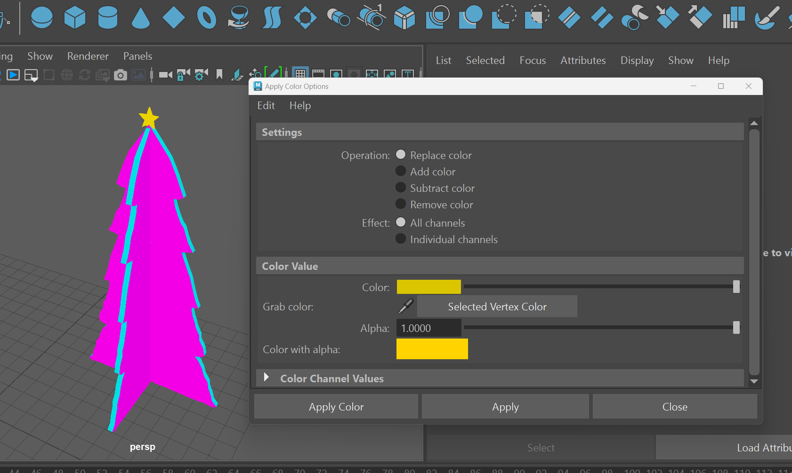

Click on meshes, go into face mode, then select the faces of the mesh as shown in the picture (All 3 sides). Select another color (Blue in the picture), then click "Apply". Do the same for the star.

# Exporting from Maya

> (!important)
> MAKE SURE THAT ALL OF THE MESH HAS A ONE MATERIAL ASSIGNED TO IT BEFORE EXPORTING (ie. Lambert1). You can check by holding down right click then selecting "Material Attributes"

Combine the 3 Meshes into one by selecting all three meshes, Mesh -> Combine

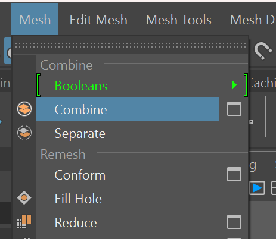

Then change your Workspace to UV Editing. On the top right side of Maya, change your workspace from "General" to "UV Editing"

From there select the mesh, then in the UV editor select Create -> automatic. This makes a automatic UV Map based upon what your combined mesh is.

> (!info)
> This process of events lets us combine the diffrent meshes of the same material into one already made UV Map.

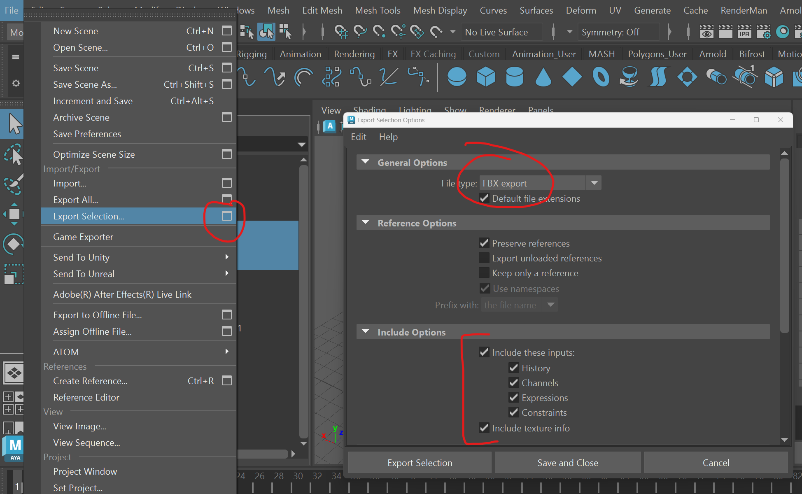

To Export the mesh, **Select your mesh**, then file -> Export Selection -> click on the window icon in the right side of the button. Make sure the file type is FBX export and that all the Include Options buttons are checked. This will now export the tree into a fbx file that you will save.

# Importing to Substance Painter

Open up Substance painter then on the top left click File -> new. This opens up the project settings. Below template there is "File". Click the select button to the right of it and select your newly exported Tree.fbx file.

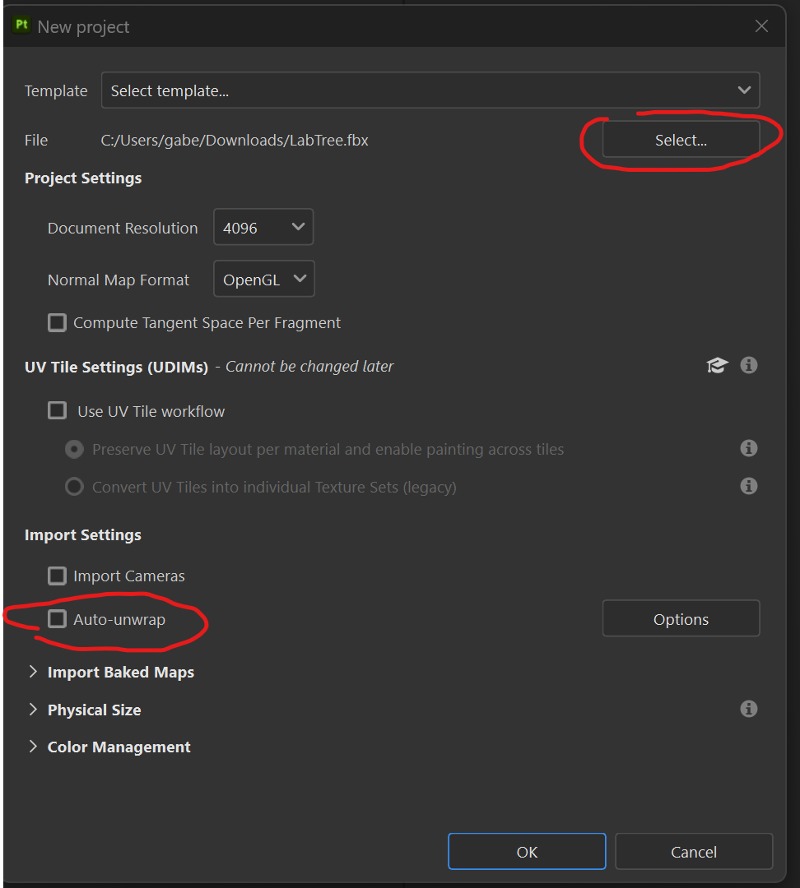

> (!important)
> Make sure that the Auto-unwrap feature is unchecked since we already UV unwrapped the file when pre-processing the mesh.

> (!info)
> The Document Resolution options is the resolution of the texture. If the mesh is a centerpiece of your short, make sure that the resolution is at least 2048 or higher. The main reason to have a resolution that is low (<1024) is to save compute time when your textured mesh is in Maya. If you have lots of textured meshes in a scene, it slows down your computer.

# Substance Painter UI and Controls

Alt + left-click to rotate camera

Alt + Right-Click to zoom camera

Shift + Right-Click to rotate lighting

Here are the full [Substance Painter Keyboard Shortcuts](https://helpx.adobe.com/substance-3d-painter/interface/settings/shortcuts.html)

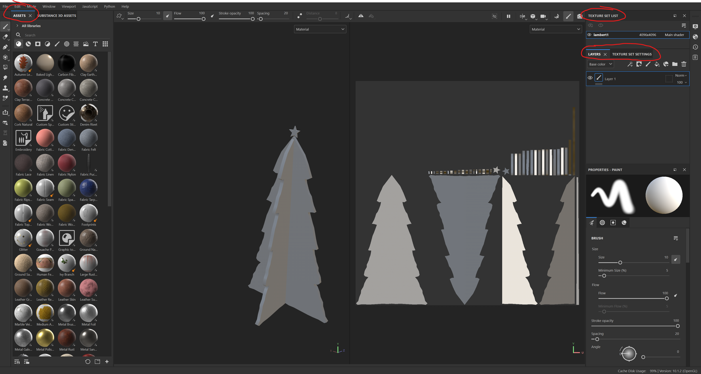
The Asset tab on the Left is where you can choose a Material preset and drag and drop it on the mesh.

The Texture Set List on the Top right is where the material for the mesh is.

> (!important)
> If you have multiple Texture sets, you did not set the mesh to one material before exporting from Maya. This will seperate the textures.

The Layers Tab and Texture Set Settings tab on the Right is where you will do most of the work.

# Baking Vertex Colors

In "Texture Set Settings", scroll down untill you see MESH MAPS. Click Bake Mesh Maps

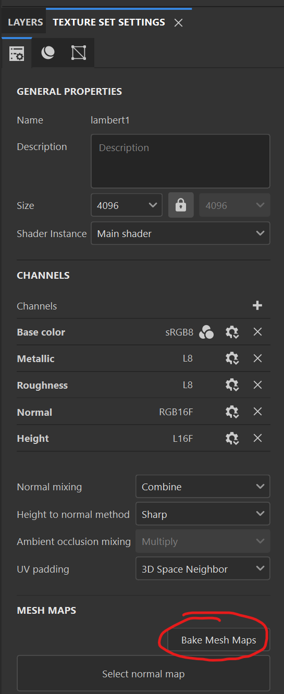

This will switch the layout to baking mode. If you want to get out and return to the original menu, click "Return to painting mode". on the bottom next to "Bake Selected textures".

From here click "ID" which is under "MESH MAP BAKERS", then change Vertex Color to Color Source. Then "Bake Selected Textures".

> (!info)
> Use the default settings for everything else when baking.

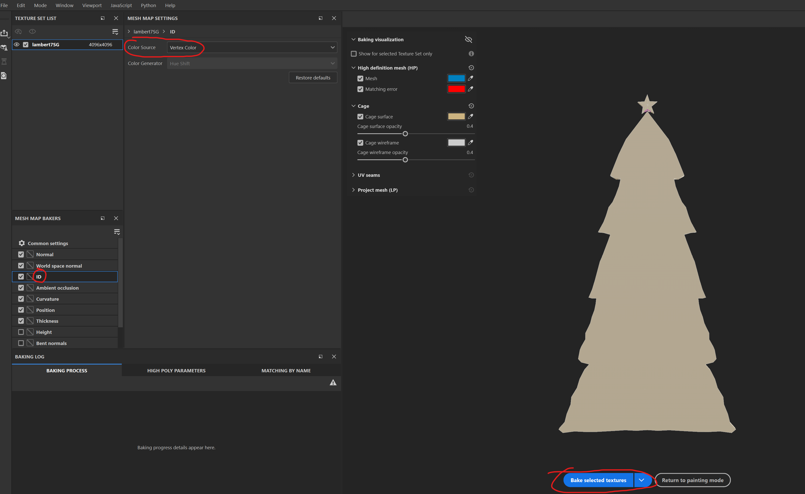

To check if your Vertex color baked correctly, click ID on the dropdown and see if your colors match up with what you baked in Maya. Reselect "Neutral material" when done.

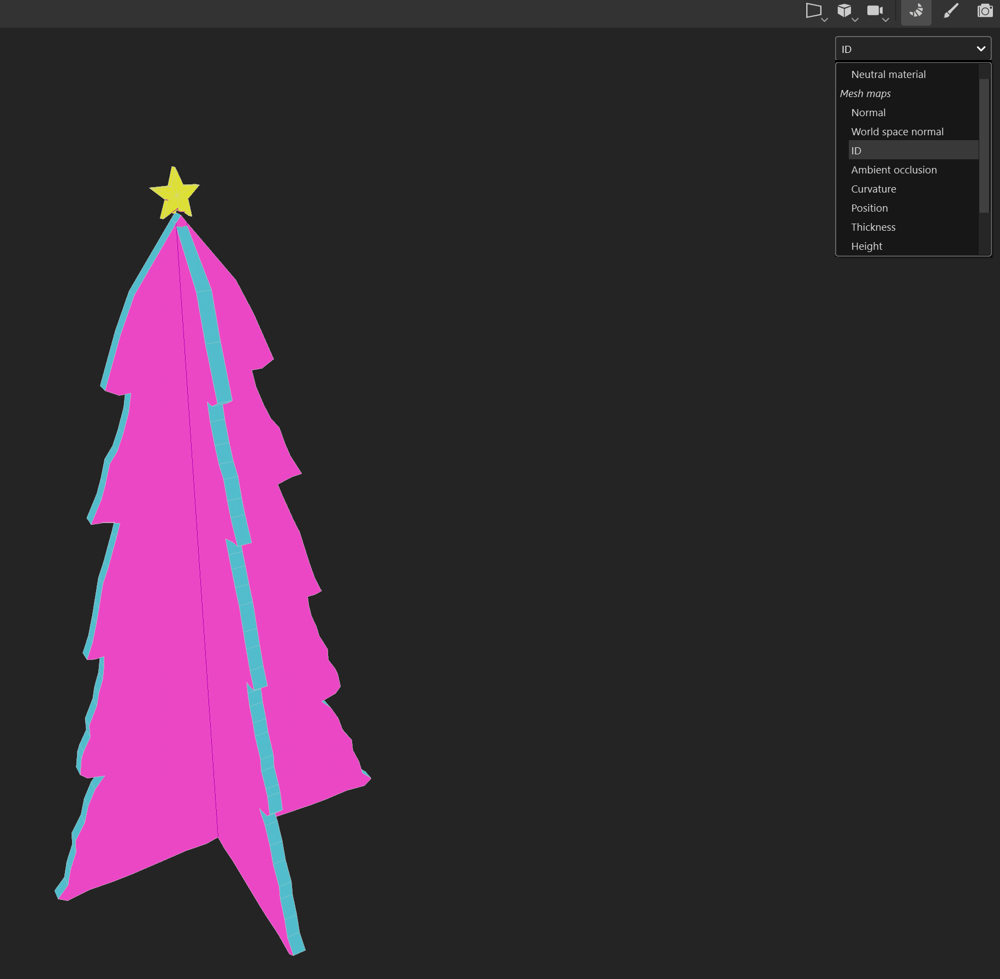

Click "Return to Painting Mode" to get back to the original layout.

# Fill Colors

In the Layers tab, click the bucket icon to create a fill layer. Rename it to "Base Color"

> (!info)
> A fill layer floods the mesh with a specific color, metallic sheen (metal), shininess (roughness), surface details through lighting (normal), surface details through mesh displacement (height). You can select or deselect each one depending on your use case.

Deselect everything on that fill layer execpt for "color", "Metallic" and, "Roughness". For Metallic, set the slider to 0 as cardboard is not metallic. For Roughness, choose a roughness over 0.7 as cardboard is not shiny. For "Color", Choose a light green color with low saturation. This [color wheel](https://www.rapidtables.com/web/color/color-wheel.html) can help you decide.

> (!info)
> Color Theory: Low saturation colors can give a good base color as we build on top of it using lighter or darker shades.

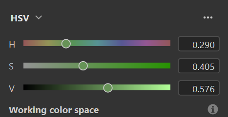

> (!info)
> Hue (H) = color type. Saturation (S) = Intensity of color. Value (V) = brightness of color

Now that we have a solid color, we can start adding varied shades of green in different ways to make it pop out and have texture.

# Black and White Masks + layering

Add another fill layer and deselect everything except for roughness and color. Make sure this layer is on top of the previous layer. Rename this to Dark Grunge and select a darker green in the color wheel. This should make your tree go from green to dark green.

> (!important)
> Substance Painter stacks layers through the top-down order. Therefore, the top layer gets priority when layering upon the mesh. If a red layer is on top of the blue layer, then the red layer will only show on the mesh.

To prevent the new layer fully replacing the green layer, we need to add a black mask. Right click the layer then add a black mask.

> (!info)
> A black mask tells substance painter what should be transparent and what should not be. A black value in a mask means 100% transparent while a white value is 0% transparent. As such, a gray value is 50% transparent.

We now have two property tabs in this new layer. Click on the square icon with a circle in the middle to access the mask property tab. In the Assets tab on the right side, search up grunge, then click the textures icon in the picture to sort by textures.
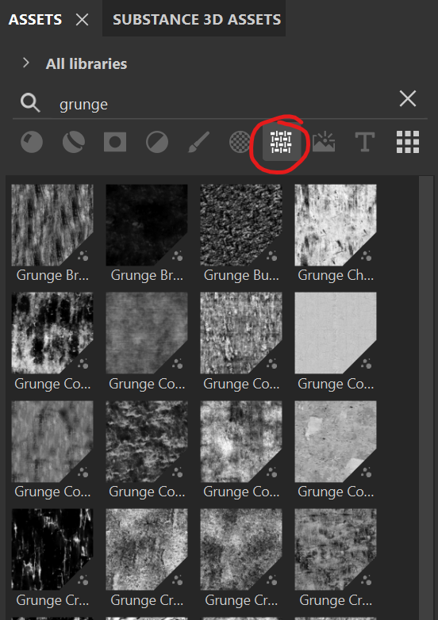

> (!important)
> As this uses both the fill and mask tabs, the image is denoted which is which. 1 is the mask tab while 2 is the fill properties tab.

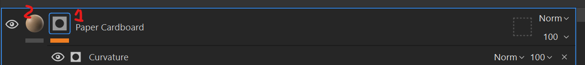

Drag and drop your selected texture to the mask property tab. This applies a dark green grunge onto your tree.

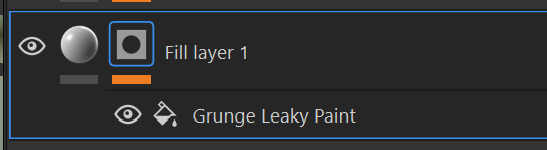

The options to play with here are **Contrast** and **Balance**. Balance is how much of the grunge there is on the mesh. Contrast is how sharp the fade from dark green to green is.

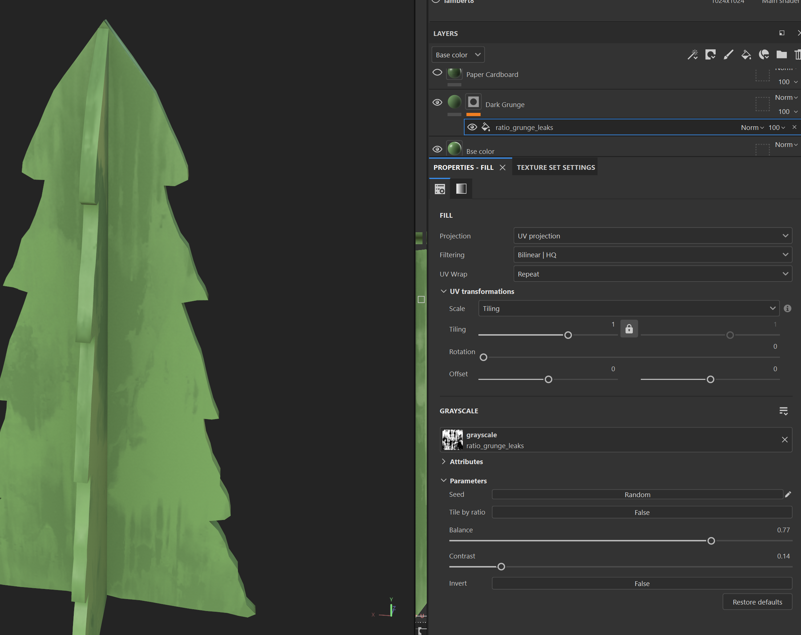

> (!important)
> Add another fill layer with a black mask but instead of dark green, choose light green instead and use a different grunge texture. Be creative in your layering process.

# Color Selection with ID Mask

Now we are going to make the edges of the tree cardboard. Select the materials button on the assets tab and search up paper cardboard. Hold CTRL + left click drag the paper cardboard material to the mesh. **DO NOT LET GO OF THE MATERIAL UNTIL YOU HOVER OVER THE MESH AND SEE THE ID COLOR VERTEX POP UP THEN LET GO ONCE YOUR MOUSE IS HOVERING THE CORRECT COLOR**. If done correctly, you should see a new layer that only affects the part that you dragged and dropped the material onto.

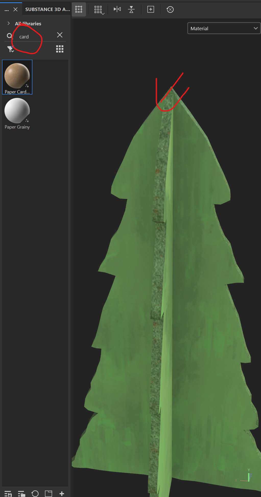

Select the material properties button shown in the picture. From here there are a plethora of options to tweak. Set the cardboard color to the base color green and the inserts color to brown. The rest of the settings is up to you.

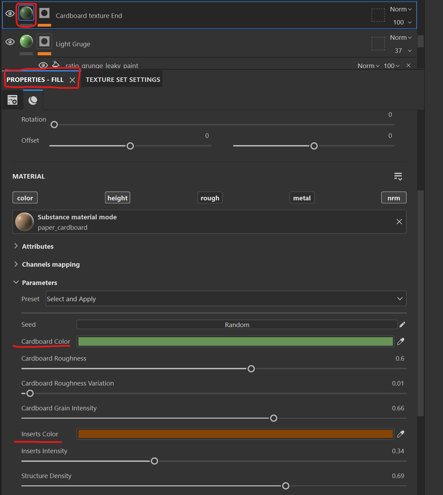

# Materials

We want a cardboard material so lets search cardboard in the assets tab and ctrl + drag and drop it on the vertex color that is not on the edges of the tree.  

From here drag the layer down so that the cardboard material is behind the grunge.

In the properties tab, we can edit the new preset texture that we put on. Select "Glossy Brown Paper Cardboard" in the preset button under parameters. As we see, there are now cardboard lines on the mesh. Change the color to be green and darker green in "Cardboard Color" and "Inserts Color" respectivly. Play with the sliders and set them to your liking.

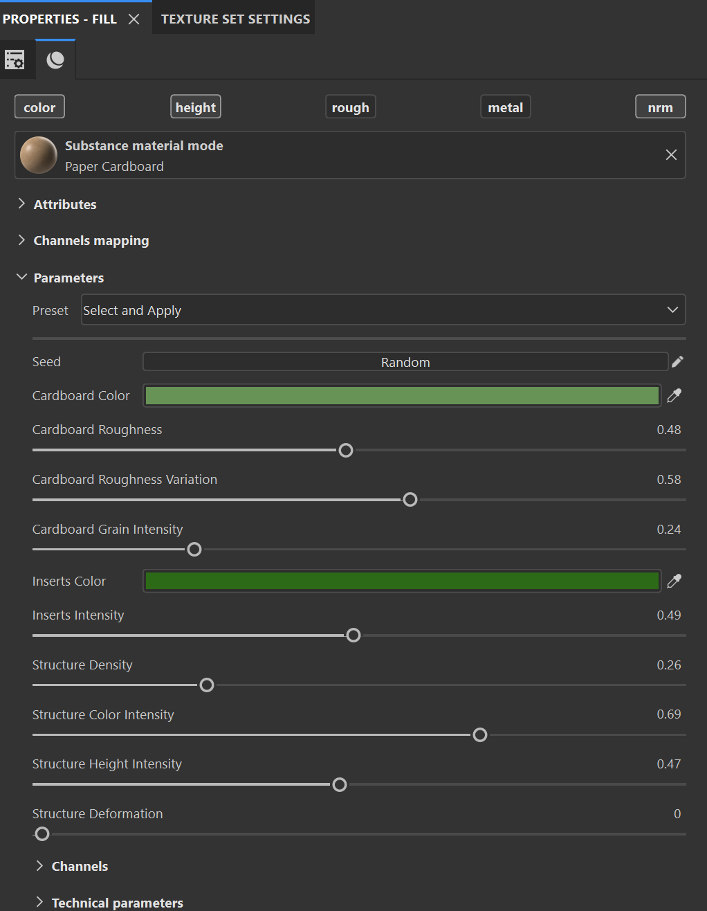

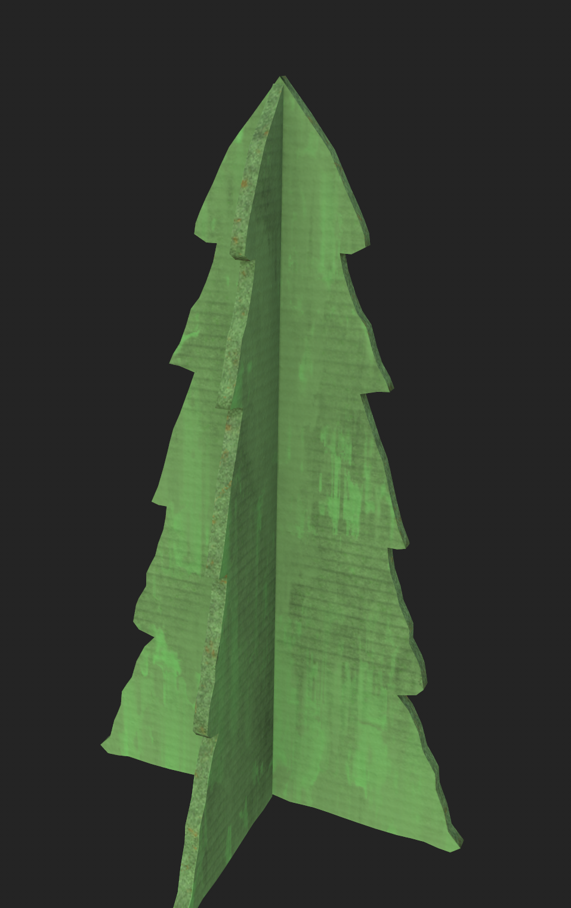

# Generators

Add a fill layer, deselect height and metal, change the color to dirt brown, then add a black mask. Now **in the black mask properties tab**, we right click the layer, and add a generator, then search up dirt and add it.

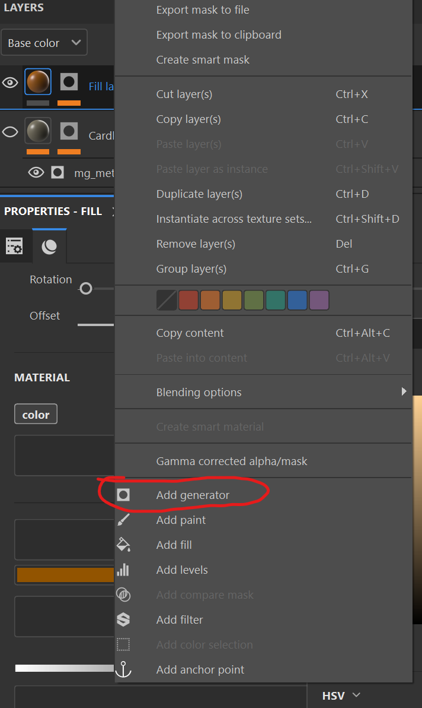

> (!info)
> A generator generates a mask based on mesh topology specified for the presets given. ie. the dirt generator generates masks based on crevices on the mesh, while metal edge wear generates masks based on convex edges.

The dirt level and Dirt Contrast sliders control how the mask operates. If you like the mask but find the color intensity not to your taste, consider lowering the slider on the right hand side of the layer from 100 to 70 or 50.

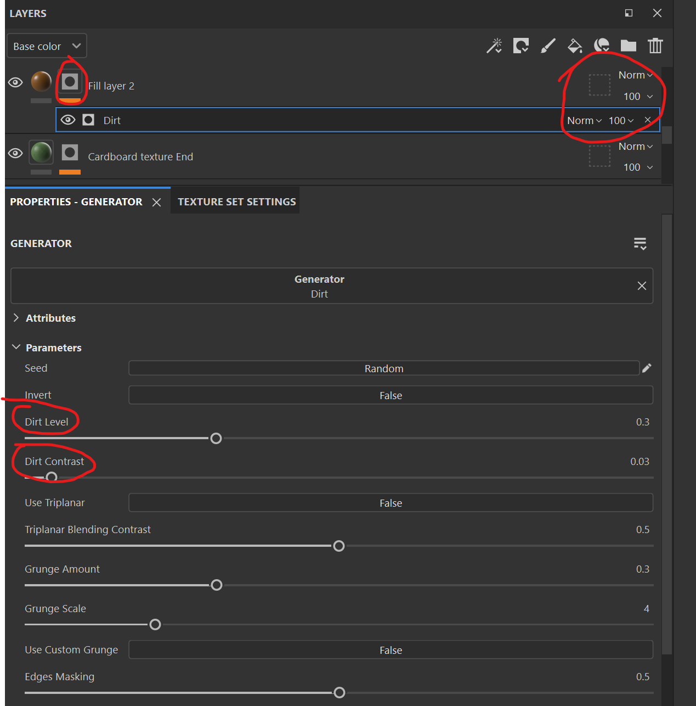

---

For the final layer, add another paper cardboard material to the vertex color that signifies the edge of the cardboard tree. While selecting the mask properties, add a generator called "Curvature". This uses the curature texture map we baked earlier (when baking vertex colors) to generate the mask. In the fill properties tab, set the color to cardboard brown.

Tweak the settings in the mask tab to your liking.

> The rest is up to your creativity, You can add faded brown splotches another grunge map or another generator.

# Roughness

In each fill tab there is a Roughness slider going from 0 (shiny) to 1 (dull).

As we set the roughness to one value in the base color layer, there is barely any variation in roughness, we need to vary the roughness just like we did the colors. In each layer decide what the roughness of that should be.

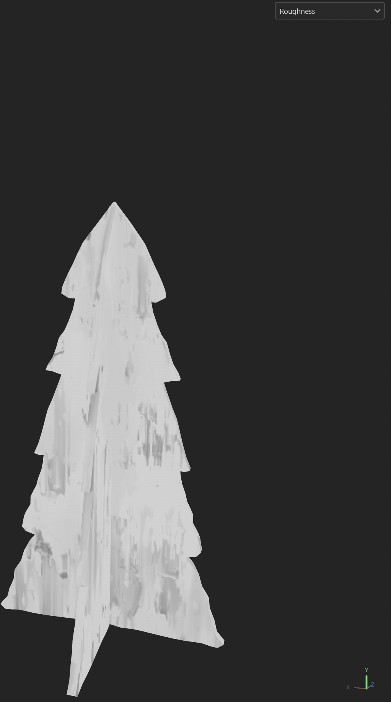

> Since we are making a handpainted cardboard tree, should we make the most recent grunge brushstrokes that are lighter more shiny or less shiny and vice versa for the darker grunge brushstrokes. What about dirt?

# Manual Painting

Lets add a handprint to the tree. Create a fill layer with a black mask. Set it to be a lighter green than your cardboard color. From here click on your black mask and in your assets tab, click on the circular checkboard called "Alphas". Search up handprint and click on it. 

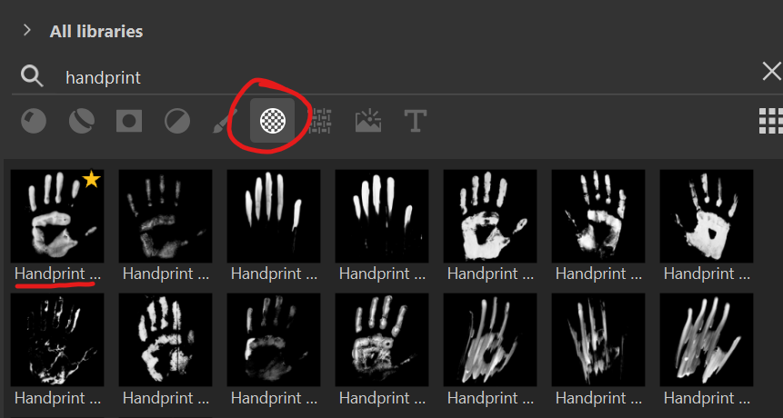

In the "Properties - Paint" tab when you click on the mask layer, we can see that the handprint that you selected is now the alpha.

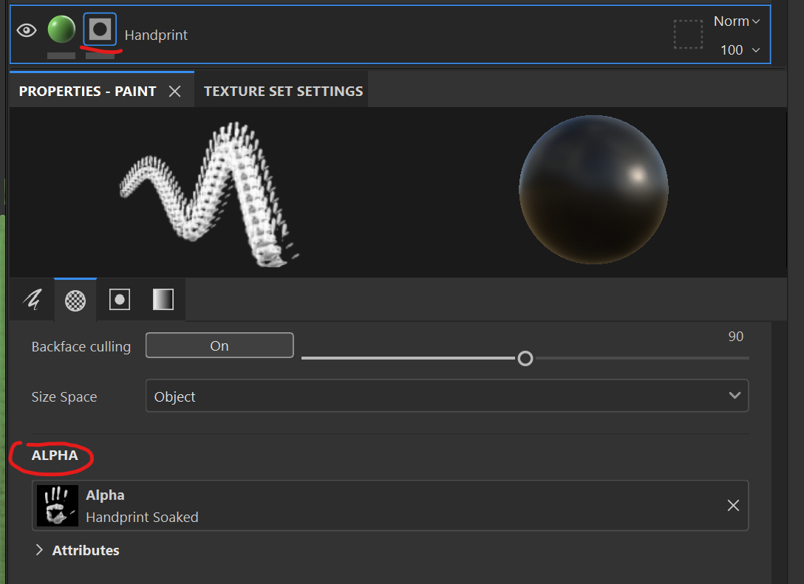

Scroll all the way down untill you see "Grayscale". Set the slider to 1 and click on the mesh to start painting.

> (!info)
> What this does is it paints the black mask white so that our layer's color can come through. 

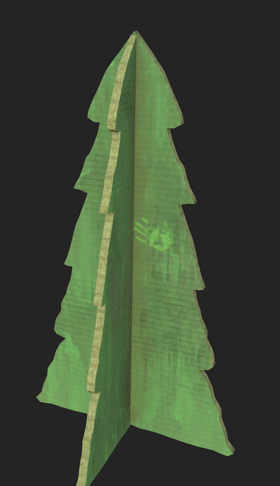

# Star (Optional)

Use the vertex colors and to drag and drop a asset material of your choosing. What should the star on the tree look like? Should we make a more metallic star or should we stick with the cardboard theme and make the star also cardboard. Be as creative as you want.

# Exporting from Substance Painter to Maya

From File -> Export Textures, a pop up window will appear with the export settings. **Change the export directory from your substance painter export file to your source images file in your current project.** Check the output template for "PBR Mettalic Roughness" and leave the rest of the settings as is.

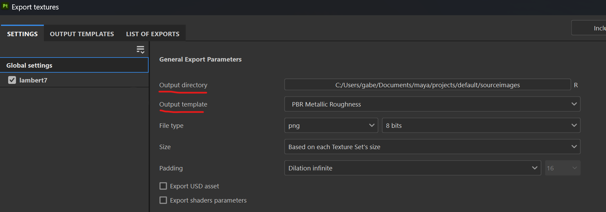

Click export and this will be the textures that will generate in your source images folder.

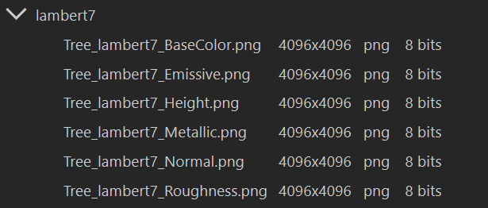

Now, we need to bridge Maya's and Substance Painter's files through plug-ins. In Maya navigate to the Plug-in Manager and enable all Substance painter 3D plugins.
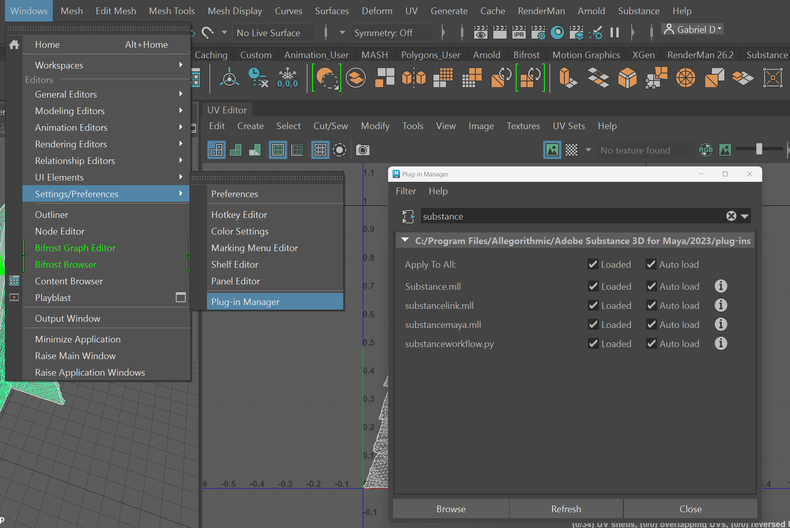

A new tab will appear on the top called "Substance". Once you click the tab, click the icon with the triple texture with an error to a filled ball with a dot called "Apply workflow to Maps". This opens up a menu. Select your images that you generates in source images and make sure to verify/ change your workflow to match your renderer. ie arnold or renderman. For this lab, we will choose arnold.

> (!important)
> The workflow here is slightly different for Renderman. Please go to the next section to see how to apply textures in Renderman

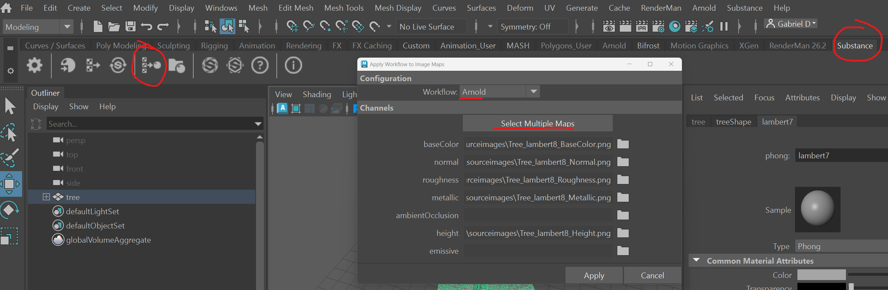

> (!important)
> If you do not have your mesh, you can export it in substance painter through File (top left on program) -> Export Mesh

To assign the material to your mesh: Click your mesh -> Hold right click -> Assign Existing Materials -> look for your new material and assign it.

> To check your material attributes: Click the mesh -> Hold right click -> Material Attributes

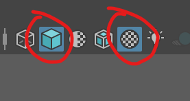

Click the textured button and the smooth shade button on the viewport to view your textured mesh. Congratulations, you have now textured your first mesh in Substance Painter.

> If your texture is dull it is due to the fact the Maya is not rendering lights and just rendering the base color. If you want lighting like the in the picture, create a volume light and place it above the tree. Finally, select the icon of the lightbulb to the right of the "Use all textures" button in the top of the viewport.

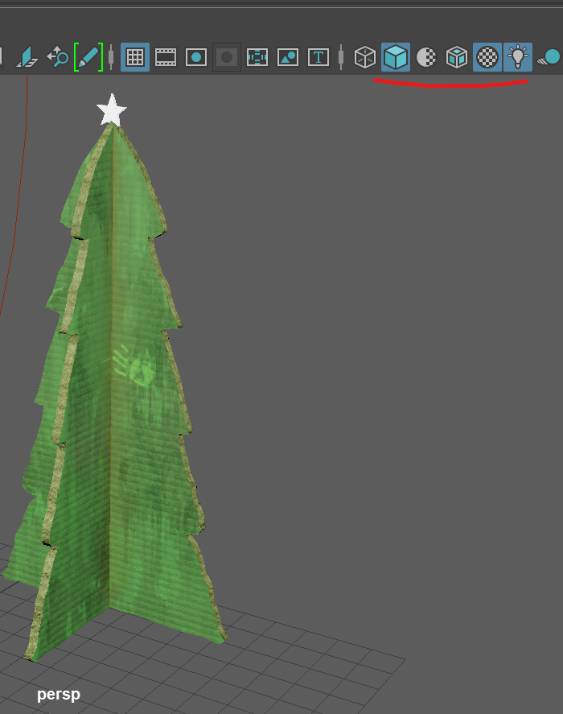

SAVE YOUR SCENE AS .MA FILE IF YOU HAVE NOT ALREADY! (save your file as often as you can). Screenshot and submit your textured tree.

## Exporting for Renderman

If you are exporting for Renderman, make sure the **Output Template** in Substance Painter is set to **PxrSurface**. Additionally, you will need to plug in your textures via the hypershade like this. It is also important to switch your OCIO configuration to ACES 1.2 in your render settings

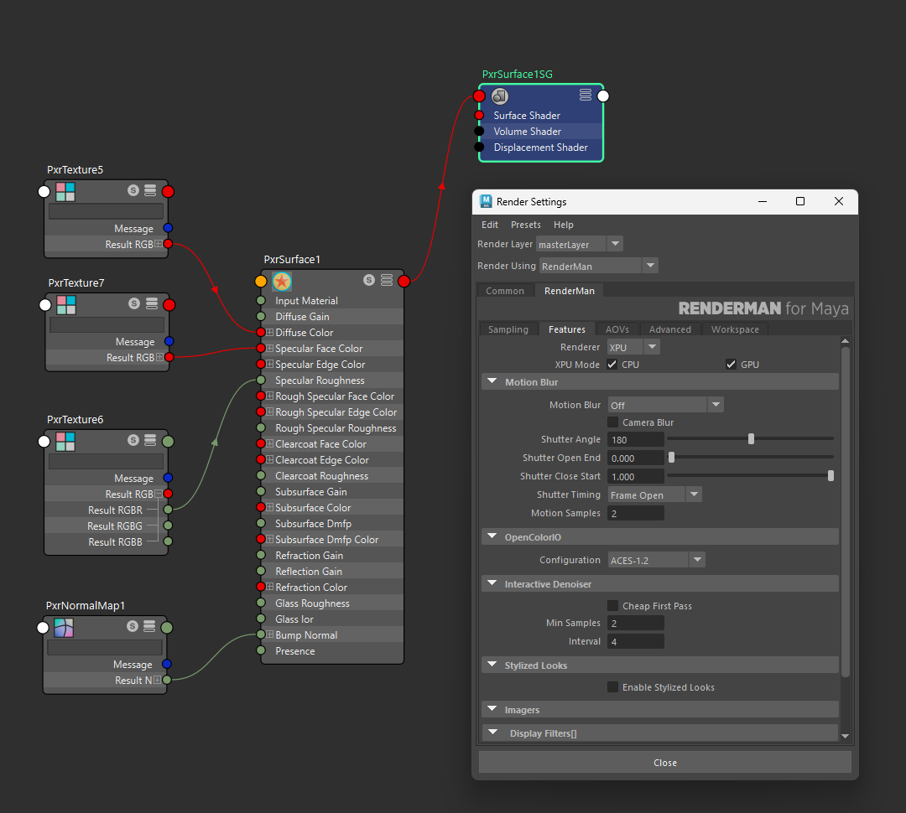

> (!important)
> Make sure all connections that use the entire RGB channel (IE: the red lines from the PxrTexture nodes) have "linearize" checked

---

Alternatively, there is another way to export to Renderman that is more efficient but also more involved to set up. You can read the [official Renderman docs](https://renderman.pixar.com/substance-to-renderman) here as well as the [github page](https://github.com/prman-pixar/RfSP) to the plugin files. Note that the docs are a bit outdated with the github link for the plugin. Use the one linked here instead.
